```python

import pandas as pd
import numpy as np
import matplotlib
from matplotlib import pyplot as plt
import requests
import networkx as nx
from bitstring import BitArray
import statistics as stat
import random

```


```python
df = pd.read_csv("NetflixViewingHistory.csv")
df = df.dropna()
df['Date'] =pd.to_datetime(df.Date)
df
```


<div>
<style scoped>
    .dataframe tbody tr th:only-of-type {
        vertical-align: middle;
    }

    .dataframe tbody tr th {
        vertical-align: top;
    }

    .dataframe thead th {
        text-align: right;
    }
</style>
<table border="1" class="dataframe">
  <thead>
    <tr style="text-align: right;">
      <th></th>
      <th>Title</th>
      <th>Date</th>
    </tr>
  </thead>
  <tbody>
    <tr>
      <th>0</th>
      <td>Kung Fu Panda 2</td>
      <td>2020-08-12</td>
    </tr>
    <tr>
      <th>1</th>
      <td>La estrella de Belén</td>
      <td>2020-07-12</td>
    </tr>
    <tr>
      <th>2</th>
      <td>Jingle Jangle: Una mágica Navidad</td>
      <td>2020-06-12</td>
    </tr>
    <tr>
      <th>3</th>
      <td>La Nochebuena es mi condena</td>
      <td>2020-06-12</td>
    </tr>
    <tr>
      <th>4</th>
      <td>Creed II: Defendiendo el legado</td>
      <td>2020-05-12</td>
    </tr>
    <tr>
      <th>...</th>
      <td>...</td>
      <td>...</td>
    </tr>
    <tr>
      <th>2035</th>
      <td>Star Trek: Discovery: Temporada 1: El contexto...</td>
      <td>2018-03-31</td>
    </tr>
    <tr>
      <th>2036</th>
      <td>Star Trek: Discovery: Temporada 1: Batalla en ...</td>
      <td>2018-03-31</td>
    </tr>
    <tr>
      <th>2037</th>
      <td>Star Trek: Discovery: Temporada 1: El saludo v...</td>
      <td>2018-03-31</td>
    </tr>
    <tr>
      <th>2038</th>
      <td>Aniquilación</td>
      <td>2018-03-31</td>
    </tr>
    <tr>
      <th>2039</th>
      <td>FullMetal Alchemist</td>
      <td>2018-03-31</td>
    </tr>
  </tbody>
</table>
<p>2035 rows × 2 columns</p>
</div>


```python
df.info()
```

    <class 'pandas.core.frame.DataFrame'>
    Int64Index: 2035 entries, 0 to 2039
    Data columns (total 2 columns):
     #   Column  Non-Null Count  Dtype         
    ---  ------  --------------  -----         
     0   Title   2035 non-null   object        
     1   Date    2035 non-null   datetime64[ns]
    dtypes: datetime64[ns](1), object(1)
    memory usage: 47.7+ KB


```python
df['Day'] = df['Date'].dt.day_name()
df
```


<div>
<style scoped>
    .dataframe tbody tr th:only-of-type {
        vertical-align: middle;
    }

    .dataframe tbody tr th {
        vertical-align: top;
    }

    .dataframe thead th {
        text-align: right;
    }
</style>
<table border="1" class="dataframe">
  <thead>
    <tr style="text-align: right;">
      <th></th>
      <th>Title</th>
      <th>Date</th>
      <th>Day</th>
    </tr>
  </thead>
  <tbody>
    <tr>
      <th>0</th>
      <td>Kung Fu Panda 2</td>
      <td>2020-08-12</td>
      <td>Wednesday</td>
    </tr>
    <tr>
      <th>1</th>
      <td>La estrella de Belén</td>
      <td>2020-07-12</td>
      <td>Sunday</td>
    </tr>
    <tr>
      <th>2</th>
      <td>Jingle Jangle: Una mágica Navidad</td>
      <td>2020-06-12</td>
      <td>Friday</td>
    </tr>
    <tr>
      <th>3</th>
      <td>La Nochebuena es mi condena</td>
      <td>2020-06-12</td>
      <td>Friday</td>
    </tr>
    <tr>
      <th>4</th>
      <td>Creed II: Defendiendo el legado</td>
      <td>2020-05-12</td>
      <td>Tuesday</td>
    </tr>
    <tr>
      <th>...</th>
      <td>...</td>
      <td>...</td>
      <td>...</td>
    </tr>
    <tr>
      <th>2035</th>
      <td>Star Trek: Discovery: Temporada 1: El contexto...</td>
      <td>2018-03-31</td>
      <td>Saturday</td>
    </tr>
    <tr>
      <th>2036</th>
      <td>Star Trek: Discovery: Temporada 1: Batalla en ...</td>
      <td>2018-03-31</td>
      <td>Saturday</td>
    </tr>
    <tr>
      <th>2037</th>
      <td>Star Trek: Discovery: Temporada 1: El saludo v...</td>
      <td>2018-03-31</td>
      <td>Saturday</td>
    </tr>
    <tr>
      <th>2038</th>
      <td>Aniquilación</td>
      <td>2018-03-31</td>
      <td>Saturday</td>
    </tr>
    <tr>
      <th>2039</th>
      <td>FullMetal Alchemist</td>
      <td>2018-03-31</td>
      <td>Saturday</td>
    </tr>
  </tbody>
</table>
<p>2035 rows × 3 columns</p>
</div>


```python
#df['Title'].split(':')
#df['Program']=df['Title'].split(':')
df['Title_1'] = df.Title.str.split(":",expand=True,)[0]
df
```


<div>
<style scoped>
    .dataframe tbody tr th:only-of-type {
        vertical-align: middle;
    }

    .dataframe tbody tr th {
        vertical-align: top;
    }

    .dataframe thead th {
        text-align: right;
    }
</style>
<table border="1" class="dataframe">
  <thead>
    <tr style="text-align: right;">
      <th></th>
      <th>Title</th>
      <th>Date</th>
      <th>Day</th>
      <th>Title_1</th>
    </tr>
  </thead>
  <tbody>
    <tr>
      <th>0</th>
      <td>Kung Fu Panda 2</td>
      <td>2020-08-12</td>
      <td>Wednesday</td>
      <td>Kung Fu Panda 2</td>
    </tr>
    <tr>
      <th>1</th>
      <td>La estrella de Belén</td>
      <td>2020-07-12</td>
      <td>Sunday</td>
      <td>La estrella de Belén</td>
    </tr>
    <tr>
      <th>2</th>
      <td>Jingle Jangle: Una mágica Navidad</td>
      <td>2020-06-12</td>
      <td>Friday</td>
      <td>Jingle Jangle</td>
    </tr>
    <tr>
      <th>3</th>
      <td>La Nochebuena es mi condena</td>
      <td>2020-06-12</td>
      <td>Friday</td>
      <td>La Nochebuena es mi condena</td>
    </tr>
    <tr>
      <th>4</th>
      <td>Creed II: Defendiendo el legado</td>
      <td>2020-05-12</td>
      <td>Tuesday</td>
      <td>Creed II</td>
    </tr>
    <tr>
      <th>...</th>
      <td>...</td>
      <td>...</td>
      <td>...</td>
      <td>...</td>
    </tr>
    <tr>
      <th>2035</th>
      <td>Star Trek: Discovery: Temporada 1: El contexto...</td>
      <td>2018-03-31</td>
      <td>Saturday</td>
      <td>Star Trek</td>
    </tr>
    <tr>
      <th>2036</th>
      <td>Star Trek: Discovery: Temporada 1: Batalla en ...</td>
      <td>2018-03-31</td>
      <td>Saturday</td>
      <td>Star Trek</td>
    </tr>
    <tr>
      <th>2037</th>
      <td>Star Trek: Discovery: Temporada 1: El saludo v...</td>
      <td>2018-03-31</td>
      <td>Saturday</td>
      <td>Star Trek</td>
    </tr>
    <tr>
      <th>2038</th>
      <td>Aniquilación</td>
      <td>2018-03-31</td>
      <td>Saturday</td>
      <td>Aniquilación</td>
    </tr>
    <tr>
      <th>2039</th>
      <td>FullMetal Alchemist</td>
      <td>2018-03-31</td>
      <td>Saturday</td>
      <td>FullMetal Alchemist</td>
    </tr>
  </tbody>
</table>
<p>2035 rows × 4 columns</p>
</div>


```python
numero_vistas = df['Title_1'].value_counts()
numero_vistas
```


    That '70s Show        179
    The Blacklist         151
    Community             109
    Brooklyn Nine-Nine     96
    Avatar                 61
                         ... 
    Iron Man                1
    Camino a Marte          1
    Animales nocturnos      1
    Lo mejor de mí          1
                            1
    Name: Title_1, Length: 466, dtype: int64


```python
numero_vistas.hist(bins=50)
```


    <AxesSubplot:>


    
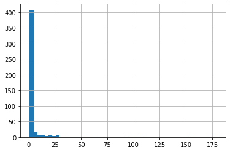
    


```python
def obtener_tipo(programas):
    resultado = []
    for titulo in programas:
        
        l_split = titulo.split(':')
        if len(l_split) == 1 : 
            resultado.append('Pelicula')
        elif len(l_split) > 1 :
            resultado.append('Serie')
        else:
            resultado.append('')
    return resultado

df['Tipo']=obtener_tipo(df['Title'])

```


```python
numero_tipo = df['Tipo'].value_counts()
print(numero_tipo)
df['Tipo'].hist(bins=50)
```

    Serie       1759
    Pelicula     276
    Name: Tipo, dtype: int64


    <AxesSubplot:>


    
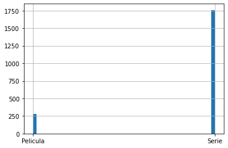
    


```python
df_peliculas = df[df['Tipo']=='Pelicula']
print(len(df_peliculas['Title_1'].unique()))

df_peliculas
```

    274


<div>
<style scoped>
    .dataframe tbody tr th:only-of-type {
        vertical-align: middle;
    }

    .dataframe tbody tr th {
        vertical-align: top;
    }

    .dataframe thead th {
        text-align: right;
    }
</style>
<table border="1" class="dataframe">
  <thead>
    <tr style="text-align: right;">
      <th></th>
      <th>Title</th>
      <th>Date</th>
      <th>Day</th>
      <th>Title_1</th>
      <th>Tipo</th>
    </tr>
  </thead>
  <tbody>
    <tr>
      <th>0</th>
      <td>Kung Fu Panda 2</td>
      <td>2020-08-12</td>
      <td>Wednesday</td>
      <td>Kung Fu Panda 2</td>
      <td>Pelicula</td>
    </tr>
    <tr>
      <th>1</th>
      <td>La estrella de Belén</td>
      <td>2020-07-12</td>
      <td>Sunday</td>
      <td>La estrella de Belén</td>
      <td>Pelicula</td>
    </tr>
    <tr>
      <th>3</th>
      <td>La Nochebuena es mi condena</td>
      <td>2020-06-12</td>
      <td>Friday</td>
      <td>La Nochebuena es mi condena</td>
      <td>Pelicula</td>
    </tr>
    <tr>
      <th>6</th>
      <td>La lista perfecta de Navidad</td>
      <td>2020-04-12</td>
      <td>Sunday</td>
      <td>La lista perfecta de Navidad</td>
      <td>Pelicula</td>
    </tr>
    <tr>
      <th>7</th>
      <td>El teléfono</td>
      <td>2020-04-12</td>
      <td>Sunday</td>
      <td>El teléfono</td>
      <td>Pelicula</td>
    </tr>
    <tr>
      <th>...</th>
      <td>...</td>
      <td>...</td>
      <td>...</td>
      <td>...</td>
      <td>...</td>
    </tr>
    <tr>
      <th>2010</th>
      <td>Guardianes de la galaxia</td>
      <td>2018-02-06</td>
      <td>Tuesday</td>
      <td>Guardianes de la galaxia</td>
      <td>Pelicula</td>
    </tr>
    <tr>
      <th>2021</th>
      <td>Los Increíbles</td>
      <td>2018-04-30</td>
      <td>Monday</td>
      <td>Los Increíbles</td>
      <td>Pelicula</td>
    </tr>
    <tr>
      <th>2027</th>
      <td>Convicto</td>
      <td>2018-04-14</td>
      <td>Saturday</td>
      <td>Convicto</td>
      <td>Pelicula</td>
    </tr>
    <tr>
      <th>2038</th>
      <td>Aniquilación</td>
      <td>2018-03-31</td>
      <td>Saturday</td>
      <td>Aniquilación</td>
      <td>Pelicula</td>
    </tr>
    <tr>
      <th>2039</th>
      <td>FullMetal Alchemist</td>
      <td>2018-03-31</td>
      <td>Saturday</td>
      <td>FullMetal Alchemist</td>
      <td>Pelicula</td>
    </tr>
  </tbody>
</table>
<p>276 rows × 5 columns</p>
</div>


```python
vistas_peliculas = df_peliculas['Title_1'].value_counts()

print(vistas_peliculas)
```

    Shaft                      2
    Perdida                    2
    El gran truco              1
    The Cloverfield Paradox    1
    Robot 7723                 1
                              ..
    30 minutos o menos         1
    El juego de Gerald         1
    Kung Fu Panda 2            1
    Asesino del futuro         1
    Perdidos en el espacio     1
    Name: Title_1, Length: 274, dtype: int64


```python
vistas_peliculas.hist(bins=50)
```


    <AxesSubplot:>


    
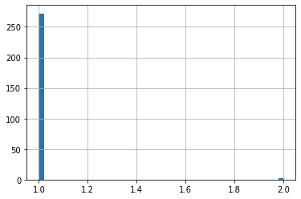
    


```python
df_series = df[df['Tipo']=='Serie']
print(len(df_series['Title_1'].unique()))
df_series
```

    196


<div>
<style scoped>
    .dataframe tbody tr th:only-of-type {
        vertical-align: middle;
    }

    .dataframe tbody tr th {
        vertical-align: top;
    }

    .dataframe thead th {
        text-align: right;
    }
</style>
<table border="1" class="dataframe">
  <thead>
    <tr style="text-align: right;">
      <th></th>
      <th>Title</th>
      <th>Date</th>
      <th>Day</th>
      <th>Title_1</th>
      <th>Tipo</th>
    </tr>
  </thead>
  <tbody>
    <tr>
      <th>2</th>
      <td>Jingle Jangle: Una mágica Navidad</td>
      <td>2020-06-12</td>
      <td>Friday</td>
      <td>Jingle Jangle</td>
      <td>Serie</td>
    </tr>
    <tr>
      <th>4</th>
      <td>Creed II: Defendiendo el legado</td>
      <td>2020-05-12</td>
      <td>Tuesday</td>
      <td>Creed II</td>
      <td>Serie</td>
    </tr>
    <tr>
      <th>5</th>
      <td>Creed: Corazón de campeón</td>
      <td>2020-05-12</td>
      <td>Tuesday</td>
      <td>Creed</td>
      <td>Serie</td>
    </tr>
    <tr>
      <th>8</th>
      <td>Un príncipe de Navidad: Bebé real</td>
      <td>2020-02-12</td>
      <td>Wednesday</td>
      <td>Un príncipe de Navidad</td>
      <td>Serie</td>
    </tr>
    <tr>
      <th>9</th>
      <td>Gambito de dama: Miniserie: Aperturas</td>
      <td>2020-11-30</td>
      <td>Monday</td>
      <td>Gambito de dama</td>
      <td>Serie</td>
    </tr>
    <tr>
      <th>...</th>
      <td>...</td>
      <td>...</td>
      <td>...</td>
      <td>...</td>
      <td>...</td>
    </tr>
    <tr>
      <th>2033</th>
      <td>Star Trek: Discovery: Temporada 1: Escoja su d...</td>
      <td>2018-03-31</td>
      <td>Saturday</td>
      <td>Star Trek</td>
      <td>Serie</td>
    </tr>
    <tr>
      <th>2034</th>
      <td>Star Trek: Discovery: Temporada 1: El cuchillo...</td>
      <td>2018-03-31</td>
      <td>Saturday</td>
      <td>Star Trek</td>
      <td>Serie</td>
    </tr>
    <tr>
      <th>2035</th>
      <td>Star Trek: Discovery: Temporada 1: El contexto...</td>
      <td>2018-03-31</td>
      <td>Saturday</td>
      <td>Star Trek</td>
      <td>Serie</td>
    </tr>
    <tr>
      <th>2036</th>
      <td>Star Trek: Discovery: Temporada 1: Batalla en ...</td>
      <td>2018-03-31</td>
      <td>Saturday</td>
      <td>Star Trek</td>
      <td>Serie</td>
    </tr>
    <tr>
      <th>2037</th>
      <td>Star Trek: Discovery: Temporada 1: El saludo v...</td>
      <td>2018-03-31</td>
      <td>Saturday</td>
      <td>Star Trek</td>
      <td>Serie</td>
    </tr>
  </tbody>
</table>
<p>1759 rows × 5 columns</p>
</div>


```python
vistas_series = df_series['Title_1'].value_counts()
print(vistas_series)
```

    That '70s Show                          179
    The Blacklist                           151
    Community                               109
    Brooklyn Nine-Nine                       96
    Avatar                                   61
                                           ... 
    Festival de la Canción de Eurovisión      1
    Spenser                                   1
    Las chicas del cable                      1
    El Barco                                  1
    Amityville                                1
    Name: Title_1, Length: 196, dtype: int64


```python
vistas_series.hist(bins=50)
```


    <AxesSubplot:>


    
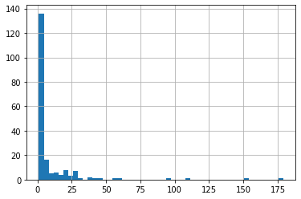
    


```python
h = df.groupby("Date")['Title_1'].count()
#df.groupby(["state", "gender"])["last_name"].count()
h.plot()
```


    <AxesSubplot:xlabel='Date'>


    
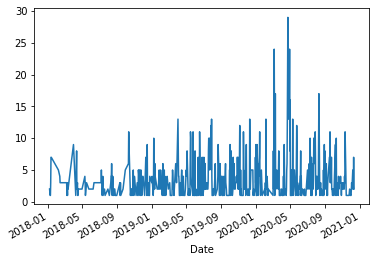
    


```python
h = df.groupby("Date")['Title_1'].count().cumsum()
h.plot()
```


    <AxesSubplot:xlabel='Date'>


    
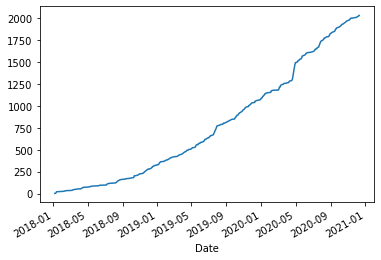
    


```python
a = df.groupby(["Date","Tipo"])['Title_1']
a.describe()
```


<div>
<style scoped>
    .dataframe tbody tr th:only-of-type {
        vertical-align: middle;
    }

    .dataframe tbody tr th {
        vertical-align: top;
    }

    .dataframe thead th {
        text-align: right;
    }
</style>
<table border="1" class="dataframe">
  <thead>
    <tr style="text-align: right;">
      <th></th>
      <th></th>
      <th>count</th>
      <th>unique</th>
      <th>top</th>
      <th>freq</th>
    </tr>
    <tr>
      <th>Date</th>
      <th>Tipo</th>
      <th></th>
      <th></th>
      <th></th>
      <th></th>
    </tr>
  </thead>
  <tbody>
    <tr>
      <th>2018-01-06</th>
      <th>Serie</th>
      <td>2</td>
      <td>1</td>
      <td>Merlí</td>
      <td>2</td>
    </tr>
    <tr>
      <th>2018-01-08</th>
      <th>Pelicula</th>
      <td>1</td>
      <td>1</td>
      <td>Papás con honores</td>
      <td>1</td>
    </tr>
    <tr>
      <th>2018-01-09</th>
      <th>Pelicula</th>
      <td>1</td>
      <td>1</td>
      <td>Órbita 9</td>
      <td>1</td>
    </tr>
    <tr>
      <th>2018-01-10</th>
      <th>Pelicula</th>
      <td>3</td>
      <td>3</td>
      <td>Mente indomable</td>
      <td>1</td>
    </tr>
    <tr>
      <th>2018-01-11</th>
      <th>Serie</th>
      <td>7</td>
      <td>2</td>
      <td>Merlí</td>
      <td>6</td>
    </tr>
    <tr>
      <th>...</th>
      <th>...</th>
      <td>...</td>
      <td>...</td>
      <td>...</td>
      <td>...</td>
    </tr>
    <tr>
      <th rowspan="2" valign="top">2020-12-06</th>
      <th>Pelicula</th>
      <td>1</td>
      <td>1</td>
      <td>Ride</td>
      <td>1</td>
    </tr>
    <tr>
      <th>Serie</th>
      <td>4</td>
      <td>3</td>
      <td>Las crónicas de Frankenstein</td>
      <td>2</td>
    </tr>
    <tr>
      <th>2020-12-08</th>
      <th>Serie</th>
      <td>2</td>
      <td>1</td>
      <td>Anne with an E</td>
      <td>2</td>
    </tr>
    <tr>
      <th>2020-12-09</th>
      <th>Serie</th>
      <td>7</td>
      <td>2</td>
      <td>Cobra Kai</td>
      <td>5</td>
    </tr>
    <tr>
      <th>2020-12-10</th>
      <th>Serie</th>
      <td>2</td>
      <td>2</td>
      <td>La maldición de Bly Manor</td>
      <td>1</td>
    </tr>
  </tbody>
</table>
<p>654 rows × 4 columns</p>
</div>


```python
a = df.groupby(["Date","Tipo"])['Title_1'].count().sort_values(ascending=False)
a = df.groupby(["Date","Tipo"])['Title_1'].count()
a.plot()
```


    <AxesSubplot:xlabel='Date,Tipo'>


    
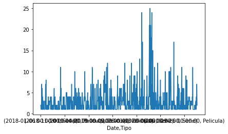
    


```python
a = df.groupby(["Day"])['Title_1'].count()
a.plot()
```


    <AxesSubplot:xlabel='Day'>


    
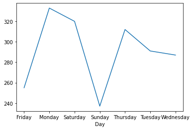
    


```python
# Obtener información de películas. 
```


```python
movie = 'Babadook'
url = 'https://api.themoviedb.org/3/search/movie?api_key=3c35ea3e9d8c1a6d96d7dd37f74a52b0&page=1&query='+movie
r = requests.get(url=url)
json = r.json()
print("Tipo:  \n",type(json),"\nLlaves:\n", json.keys(),"\nResultados: \n", json['total_results'])
print(json['results'][0].keys())


```

    Tipo:  
     <class 'dict'> 
    Llaves:
     dict_keys(['page', 'results', 'total_pages', 'total_results']) 
    Resultados: 
     2
    dict_keys(['adult', 'backdrop_path', 'genre_ids', 'id', 'original_language', 'original_title', 'overview', 'popularity', 'poster_path', 'release_date', 'title', 'video', 'vote_average', 'vote_count'])


# Obtener información de los generos


```python
#https://developers.themoviedb.org/3/genres/get-movie-list
url = 'https://api.themoviedb.org/3/genre/movie/list?api_key=3c35ea3e9d8c1a6d96d7dd37f74a52b0&language=en-US'
r = requests.get(url=url)
json = r.json()
print(json)
l_gen = json['genres']
dict_g = {}
j = 0 
for g in l_gen:
    key = g['id']
    dict_g[key]= j
    j = j +1 
    
print(dict_g)
```

    {'genres': [{'id': 28, 'name': 'Action'}, {'id': 12, 'name': 'Adventure'}, {'id': 16, 'name': 'Animation'}, {'id': 35, 'name': 'Comedy'}, {'id': 80, 'name': 'Crime'}, {'id': 99, 'name': 'Documentary'}, {'id': 18, 'name': 'Drama'}, {'id': 10751, 'name': 'Family'}, {'id': 14, 'name': 'Fantasy'}, {'id': 36, 'name': 'History'}, {'id': 27, 'name': 'Horror'}, {'id': 10402, 'name': 'Music'}, {'id': 9648, 'name': 'Mystery'}, {'id': 10749, 'name': 'Romance'}, {'id': 878, 'name': 'Science Fiction'}, {'id': 10770, 'name': 'TV Movie'}, {'id': 53, 'name': 'Thriller'}, {'id': 10752, 'name': 'War'}, {'id': 37, 'name': 'Western'}]}
    {28: 0, 12: 1, 16: 2, 35: 3, 80: 4, 99: 5, 18: 6, 10751: 7, 14: 8, 36: 9, 27: 10, 10402: 11, 9648: 12, 10749: 13, 878: 14, 10770: 15, 53: 16, 10752: 17, 37: 18}


```python
def obtener_diccionario(movie, generos):
    diccionario={}
    #diccionario['pelicula'] = movie
    for g in generos :
        diccionario[g]= 1
    return diccionario

```

# Dataframe peliculas


```python
dict_m = {}
# obtener lista de las peliculas del dataframe

lista_m = df_peliculas['Title_1']
df_moviedb = pd.DataFrame( )
# i Peliculas con solo un registro
i = 0
# j peliculas con mas de un registro
j = 0 
# Peliculas sin registro 
k = 0 
for movie in lista_m:
    url = 'https://api.themoviedb.org/3/search/movie?api_key=3c35ea3e9d8c1a6d96d7dd37f74a52b0&page=1&query='+movie
    r = requests.get(url=url)
    json = r.json()
    # si solo hay un registro: 
    if len ( json['results'] ) == 1 :
        
        lista_generos = json['results'][0]['genre_ids']
        generos = obtener_diccionario(movie, lista_generos)
        #generos = json['results'][0]
        df_moviedb = df_moviedb.append(generos,ignore_index=True)
       
        i = i +1
    elif json["total_results"] > 1:
        print("Pelicula con mas de un registro "+movie)
        j = j +1
    else:
        print("Pelicula no encontrada "+movie)
        k = k +1
         
print( i,":",j,":",k )
```

    Pelicula con mas de un registro Kung Fu Panda 2
    Pelicula con mas de un registro La estrella de Belén
    Pelicula no encontrada La lista perfecta de Navidad
    Pelicula con mas de un registro El teléfono
    Pelicula con mas de un registro Un príncipe de Navidad
    Pelicula con mas de un registro Flechazo a primera vista
    Pelicula con mas de un registro Intercambio de princesas 2
    Pelicula no encontrada Una Navidad en Alaska
    Pelicula no encontrada El secreto de Navidad
    Pelicula no encontrada Una Navidad a la medida
    Pelicula con mas de un registro Escuadrón 6
    Pelicula con mas de un registro Kung Fu Panda
    Pelicula con mas de un registro No respires
    Pelicula con mas de un registro La leyenda del jinete sin cabeza
    Pelicula con mas de un registro Spectral
    Pelicula con mas de un registro Control total
    Pelicula con mas de un registro Wolf Warrior
    Pelicula con mas de un registro Cars 2
    Pelicula con mas de un registro El stand de los besos
    Pelicula con mas de un registro Los caballeros
    Pelicula con mas de un registro MILF
    Pelicula con mas de un registro Perro Salvaje
    Pelicula con mas de un registro Círculo
    Pelicula con mas de un registro Inmortales
    Pelicula con mas de un registro Anon
    Pelicula con mas de un registro Francotirador
    Pelicula con mas de un registro Dumplin
    Pelicula con mas de un registro Mujer Maravilla
    Pelicula con mas de un registro Ride
    Pelicula con mas de un registro Feliz día de tu muerte
    Pelicula con mas de un registro Vaselina
    Pelicula con mas de un registro Climax
    Pelicula con mas de un registro Señorita J
    Pelicula con mas de un registro La niñera
    Pelicula con mas de un registro A pesar de todo
    Pelicula con mas de un registro Misión de rescate
    Pelicula con mas de un registro Epidemia
    Pelicula con mas de un registro La influencia
    Pelicula con mas de un registro Salvajes
    Pelicula con mas de un registro Perdida
    Pelicula con mas de un registro En carne viva
    Pelicula no encontrada La mujer más odiada de Estados Unidos
    Pelicula con mas de un registro El perfecto asesino
    Pelicula con mas de un registro El Irlandés
    Pelicula con mas de un registro ¡Huye!
    Pelicula con mas de un registro Perdidos en el espacio
    Pelicula con mas de un registro The Discovery
    Pelicula con mas de un registro The Perfection
    Pelicula con mas de un registro Hogar dulce hogar
    Pelicula con mas de un registro Como caído del cielo
    Pelicula con mas de un registro The Saint
    Pelicula con mas de un registro Rápidos y furiosos 8
    Pelicula con mas de un registro Noches blancas
    Pelicula no encontrada La mecánica del hombre
    Pelicula con mas de un registro Klaus
    Pelicula con mas de un registro El rey
    Pelicula con mas de un registro 7 deseos
    Pelicula con mas de un registro Fractura
    Pelicula con mas de un registro Swiped
    Pelicula con mas de un registro Psicópata americano
    Pelicula con mas de un registro Verónica
    Pelicula con mas de un registro Kardec
    Pelicula con mas de un registro Shaft
    Pelicula con mas de un registro Venganza fatal
    Pelicula con mas de un registro Shaft
    Pelicula con mas de un registro Réplicas
    Pelicula con mas de un registro Como si fuera la primera vez
    Pelicula con mas de un registro Los siete pecados capitales
    Pelicula con mas de un registro El plan perfecto
    Pelicula con mas de un registro Déjà Vu
    Pelicula con mas de un registro El gran truco
    Pelicula con mas de un registro Señales
    Pelicula con mas de un registro El origen
    Pelicula con mas de un registro La casa del lago
    Pelicula con mas de un registro El aviso
    Pelicula con mas de un registro El paquete
    Pelicula con mas de un registro Beats
    Pelicula con mas de un registro Novato
    Pelicula con mas de un registro I Am Mother
    Pelicula con mas de un registro Durante la tormenta
    Pelicula con mas de un registro El conjuro 2
    Pelicula con mas de un registro Un novato en apuros 2
    Pelicula con mas de un registro Armados y peligrosos
    Pelicula con mas de un registro Nuestro último verano
    Pelicula con mas de un registro Perdida
    Pelicula con mas de un registro Madre
    Pelicula con mas de un registro Mulan
    Pelicula con mas de un registro La langosta
    Pelicula con mas de un registro Falsa identidad
    Pelicula con mas de un registro Dos policías rebeldes 2
    Pelicula con mas de un registro Red social
    Pelicula con mas de un registro La última ola
    Pelicula con mas de un registro Pandora
    Pelicula con mas de un registro Contratiempo
    Pelicula no encontrada La designada ultra fea
    Pelicula con mas de un registro El hombre de acero
    Pelicula con mas de un registro Colonia
    Pelicula con mas de un registro Bright
    Pelicula con mas de un registro Escolta
    Pelicula con mas de un registro El sexto sentido
    Pelicula no encontrada Monty Python - El sentido de la vida
    Pelicula no encontrada Hagamos una orgía
    Pelicula con mas de un registro Damage
    Pelicula con mas de un registro Amor a segunda vista
    Pelicula con mas de un registro Cómo entrenar a tu dragón
    Pelicula con mas de un registro White Girl
    Pelicula con mas de un registro Bajo el mismo cielo
    Pelicula con mas de un registro La bruja
    Pelicula con mas de un registro Babadook
    Pelicula con mas de un registro Mentes maestras
    Pelicula con mas de un registro Intercambio de princesas
    Pelicula con mas de un registro Silencio
    Pelicula con mas de un registro ROMA
    Pelicula con mas de un registro El sustituto
    Pelicula con mas de un registro Mamá
    Pelicula con mas de un registro Asesino del futuro
    Pelicula no encontrada Rescate del metro 123
    Pelicula con mas de un registro El protegido
    Pelicula con mas de un registro Monty Python and the Holy Grail
    Pelicula con mas de un registro Casino
    Pelicula con mas de un registro Orgullo y prejuicio
    Pelicula con mas de un registro Intensamente
    Pelicula con mas de un registro Órbita 9
    Pelicula con mas de un registro Revancha
    Pelicula con mas de un registro Lo mejor de mí
    Pelicula con mas de un registro No me olvides
    Pelicula con mas de un registro La última profecía
    Pelicula con mas de un registro Extinción
    Pelicula con mas de un registro La invitación
    Pelicula con mas de un registro La jefa
    Pelicula con mas de un registro Cargo
    Pelicula con mas de un registro Corazones de hierro
    Pelicula con mas de un registro Guardianes de la galaxia
    Pelicula con mas de un registro Los Increíbles
    Pelicula con mas de un registro Convicto
    Pelicula con mas de un registro Aniquilación
    Pelicula con mas de un registro FullMetal Alchemist
    139 : 127 : 10


```python
df_moviedb
```


<div>
<style scoped>
    .dataframe tbody tr th:only-of-type {
        vertical-align: middle;
    }

    .dataframe tbody tr th {
        vertical-align: top;
    }

    .dataframe thead th {
        text-align: right;
    }
</style>
<table border="1" class="dataframe">
  <thead>
    <tr style="text-align: right;">
      <th></th>
      <th>35</th>
      <th>10751</th>
      <th>10749</th>
      <th>14</th>
      <th>27</th>
      <th>9648</th>
      <th>18</th>
      <th>80</th>
      <th>37</th>
      <th>53</th>
      <th>28</th>
      <th>878</th>
      <th>16</th>
      <th>36</th>
      <th>12</th>
      <th>10770</th>
      <th>99</th>
      <th>10752</th>
      <th>10402</th>
    </tr>
  </thead>
  <tbody>
    <tr>
      <th>0</th>
      <td>1.0</td>
      <td>1.0</td>
      <td>NaN</td>
      <td>NaN</td>
      <td>NaN</td>
      <td>NaN</td>
      <td>NaN</td>
      <td>NaN</td>
      <td>NaN</td>
      <td>NaN</td>
      <td>NaN</td>
      <td>NaN</td>
      <td>NaN</td>
      <td>NaN</td>
      <td>NaN</td>
      <td>NaN</td>
      <td>NaN</td>
      <td>NaN</td>
      <td>NaN</td>
    </tr>
    <tr>
      <th>1</th>
      <td>1.0</td>
      <td>NaN</td>
      <td>1.0</td>
      <td>NaN</td>
      <td>NaN</td>
      <td>NaN</td>
      <td>NaN</td>
      <td>NaN</td>
      <td>NaN</td>
      <td>NaN</td>
      <td>NaN</td>
      <td>NaN</td>
      <td>NaN</td>
      <td>NaN</td>
      <td>NaN</td>
      <td>NaN</td>
      <td>NaN</td>
      <td>NaN</td>
      <td>NaN</td>
    </tr>
    <tr>
      <th>2</th>
      <td>1.0</td>
      <td>1.0</td>
      <td>1.0</td>
      <td>NaN</td>
      <td>NaN</td>
      <td>NaN</td>
      <td>NaN</td>
      <td>NaN</td>
      <td>NaN</td>
      <td>NaN</td>
      <td>NaN</td>
      <td>NaN</td>
      <td>NaN</td>
      <td>NaN</td>
      <td>NaN</td>
      <td>NaN</td>
      <td>NaN</td>
      <td>NaN</td>
      <td>NaN</td>
    </tr>
    <tr>
      <th>3</th>
      <td>1.0</td>
      <td>NaN</td>
      <td>1.0</td>
      <td>NaN</td>
      <td>NaN</td>
      <td>NaN</td>
      <td>NaN</td>
      <td>NaN</td>
      <td>NaN</td>
      <td>NaN</td>
      <td>NaN</td>
      <td>NaN</td>
      <td>NaN</td>
      <td>NaN</td>
      <td>NaN</td>
      <td>NaN</td>
      <td>NaN</td>
      <td>NaN</td>
      <td>NaN</td>
    </tr>
    <tr>
      <th>4</th>
      <td>1.0</td>
      <td>NaN</td>
      <td>NaN</td>
      <td>1.0</td>
      <td>1.0</td>
      <td>1.0</td>
      <td>NaN</td>
      <td>NaN</td>
      <td>NaN</td>
      <td>NaN</td>
      <td>NaN</td>
      <td>NaN</td>
      <td>NaN</td>
      <td>NaN</td>
      <td>NaN</td>
      <td>NaN</td>
      <td>NaN</td>
      <td>NaN</td>
      <td>NaN</td>
    </tr>
    <tr>
      <th>...</th>
      <td>...</td>
      <td>...</td>
      <td>...</td>
      <td>...</td>
      <td>...</td>
      <td>...</td>
      <td>...</td>
      <td>...</td>
      <td>...</td>
      <td>...</td>
      <td>...</td>
      <td>...</td>
      <td>...</td>
      <td>...</td>
      <td>...</td>
      <td>...</td>
      <td>...</td>
      <td>...</td>
      <td>...</td>
    </tr>
    <tr>
      <th>134</th>
      <td>NaN</td>
      <td>NaN</td>
      <td>NaN</td>
      <td>NaN</td>
      <td>NaN</td>
      <td>1.0</td>
      <td>NaN</td>
      <td>NaN</td>
      <td>NaN</td>
      <td>1.0</td>
      <td>NaN</td>
      <td>1.0</td>
      <td>NaN</td>
      <td>NaN</td>
      <td>NaN</td>
      <td>NaN</td>
      <td>NaN</td>
      <td>NaN</td>
      <td>NaN</td>
    </tr>
    <tr>
      <th>135</th>
      <td>1.0</td>
      <td>NaN</td>
      <td>NaN</td>
      <td>NaN</td>
      <td>NaN</td>
      <td>NaN</td>
      <td>NaN</td>
      <td>NaN</td>
      <td>NaN</td>
      <td>NaN</td>
      <td>NaN</td>
      <td>NaN</td>
      <td>NaN</td>
      <td>NaN</td>
      <td>NaN</td>
      <td>NaN</td>
      <td>NaN</td>
      <td>NaN</td>
      <td>NaN</td>
    </tr>
    <tr>
      <th>136</th>
      <td>1.0</td>
      <td>1.0</td>
      <td>NaN</td>
      <td>NaN</td>
      <td>NaN</td>
      <td>NaN</td>
      <td>NaN</td>
      <td>NaN</td>
      <td>NaN</td>
      <td>NaN</td>
      <td>NaN</td>
      <td>NaN</td>
      <td>NaN</td>
      <td>NaN</td>
      <td>1.0</td>
      <td>NaN</td>
      <td>NaN</td>
      <td>NaN</td>
      <td>NaN</td>
    </tr>
    <tr>
      <th>137</th>
      <td>1.0</td>
      <td>NaN</td>
      <td>NaN</td>
      <td>NaN</td>
      <td>NaN</td>
      <td>NaN</td>
      <td>1.0</td>
      <td>1.0</td>
      <td>NaN</td>
      <td>NaN</td>
      <td>NaN</td>
      <td>NaN</td>
      <td>NaN</td>
      <td>NaN</td>
      <td>NaN</td>
      <td>NaN</td>
      <td>NaN</td>
      <td>NaN</td>
      <td>NaN</td>
    </tr>
    <tr>
      <th>138</th>
      <td>1.0</td>
      <td>NaN</td>
      <td>NaN</td>
      <td>NaN</td>
      <td>NaN</td>
      <td>NaN</td>
      <td>NaN</td>
      <td>NaN</td>
      <td>NaN</td>
      <td>NaN</td>
      <td>NaN</td>
      <td>NaN</td>
      <td>NaN</td>
      <td>NaN</td>
      <td>NaN</td>
      <td>NaN</td>
      <td>NaN</td>
      <td>NaN</td>
      <td>NaN</td>
    </tr>
  </tbody>
</table>
<p>139 rows × 19 columns</p>
</div>


```python
df_moviedb= df_moviedb.fillna(0)
df_moviedb
```


<div>
<style scoped>
    .dataframe tbody tr th:only-of-type {
        vertical-align: middle;
    }

    .dataframe tbody tr th {
        vertical-align: top;
    }

    .dataframe thead th {
        text-align: right;
    }
</style>
<table border="1" class="dataframe">
  <thead>
    <tr style="text-align: right;">
      <th></th>
      <th>35</th>
      <th>10751</th>
      <th>10749</th>
      <th>14</th>
      <th>27</th>
      <th>9648</th>
      <th>18</th>
      <th>80</th>
      <th>37</th>
      <th>53</th>
      <th>28</th>
      <th>878</th>
      <th>16</th>
      <th>36</th>
      <th>12</th>
      <th>10770</th>
      <th>99</th>
      <th>10752</th>
      <th>10402</th>
    </tr>
  </thead>
  <tbody>
    <tr>
      <th>0</th>
      <td>1.0</td>
      <td>1.0</td>
      <td>0.0</td>
      <td>0.0</td>
      <td>0.0</td>
      <td>0.0</td>
      <td>0.0</td>
      <td>0.0</td>
      <td>0.0</td>
      <td>0.0</td>
      <td>0.0</td>
      <td>0.0</td>
      <td>0.0</td>
      <td>0.0</td>
      <td>0.0</td>
      <td>0.0</td>
      <td>0.0</td>
      <td>0.0</td>
      <td>0.0</td>
    </tr>
    <tr>
      <th>1</th>
      <td>1.0</td>
      <td>0.0</td>
      <td>1.0</td>
      <td>0.0</td>
      <td>0.0</td>
      <td>0.0</td>
      <td>0.0</td>
      <td>0.0</td>
      <td>0.0</td>
      <td>0.0</td>
      <td>0.0</td>
      <td>0.0</td>
      <td>0.0</td>
      <td>0.0</td>
      <td>0.0</td>
      <td>0.0</td>
      <td>0.0</td>
      <td>0.0</td>
      <td>0.0</td>
    </tr>
    <tr>
      <th>2</th>
      <td>1.0</td>
      <td>1.0</td>
      <td>1.0</td>
      <td>0.0</td>
      <td>0.0</td>
      <td>0.0</td>
      <td>0.0</td>
      <td>0.0</td>
      <td>0.0</td>
      <td>0.0</td>
      <td>0.0</td>
      <td>0.0</td>
      <td>0.0</td>
      <td>0.0</td>
      <td>0.0</td>
      <td>0.0</td>
      <td>0.0</td>
      <td>0.0</td>
      <td>0.0</td>
    </tr>
    <tr>
      <th>3</th>
      <td>1.0</td>
      <td>0.0</td>
      <td>1.0</td>
      <td>0.0</td>
      <td>0.0</td>
      <td>0.0</td>
      <td>0.0</td>
      <td>0.0</td>
      <td>0.0</td>
      <td>0.0</td>
      <td>0.0</td>
      <td>0.0</td>
      <td>0.0</td>
      <td>0.0</td>
      <td>0.0</td>
      <td>0.0</td>
      <td>0.0</td>
      <td>0.0</td>
      <td>0.0</td>
    </tr>
    <tr>
      <th>4</th>
      <td>1.0</td>
      <td>0.0</td>
      <td>0.0</td>
      <td>1.0</td>
      <td>1.0</td>
      <td>1.0</td>
      <td>0.0</td>
      <td>0.0</td>
      <td>0.0</td>
      <td>0.0</td>
      <td>0.0</td>
      <td>0.0</td>
      <td>0.0</td>
      <td>0.0</td>
      <td>0.0</td>
      <td>0.0</td>
      <td>0.0</td>
      <td>0.0</td>
      <td>0.0</td>
    </tr>
    <tr>
      <th>...</th>
      <td>...</td>
      <td>...</td>
      <td>...</td>
      <td>...</td>
      <td>...</td>
      <td>...</td>
      <td>...</td>
      <td>...</td>
      <td>...</td>
      <td>...</td>
      <td>...</td>
      <td>...</td>
      <td>...</td>
      <td>...</td>
      <td>...</td>
      <td>...</td>
      <td>...</td>
      <td>...</td>
      <td>...</td>
    </tr>
    <tr>
      <th>134</th>
      <td>0.0</td>
      <td>0.0</td>
      <td>0.0</td>
      <td>0.0</td>
      <td>0.0</td>
      <td>1.0</td>
      <td>0.0</td>
      <td>0.0</td>
      <td>0.0</td>
      <td>1.0</td>
      <td>0.0</td>
      <td>1.0</td>
      <td>0.0</td>
      <td>0.0</td>
      <td>0.0</td>
      <td>0.0</td>
      <td>0.0</td>
      <td>0.0</td>
      <td>0.0</td>
    </tr>
    <tr>
      <th>135</th>
      <td>1.0</td>
      <td>0.0</td>
      <td>0.0</td>
      <td>0.0</td>
      <td>0.0</td>
      <td>0.0</td>
      <td>0.0</td>
      <td>0.0</td>
      <td>0.0</td>
      <td>0.0</td>
      <td>0.0</td>
      <td>0.0</td>
      <td>0.0</td>
      <td>0.0</td>
      <td>0.0</td>
      <td>0.0</td>
      <td>0.0</td>
      <td>0.0</td>
      <td>0.0</td>
    </tr>
    <tr>
      <th>136</th>
      <td>1.0</td>
      <td>1.0</td>
      <td>0.0</td>
      <td>0.0</td>
      <td>0.0</td>
      <td>0.0</td>
      <td>0.0</td>
      <td>0.0</td>
      <td>0.0</td>
      <td>0.0</td>
      <td>0.0</td>
      <td>0.0</td>
      <td>0.0</td>
      <td>0.0</td>
      <td>1.0</td>
      <td>0.0</td>
      <td>0.0</td>
      <td>0.0</td>
      <td>0.0</td>
    </tr>
    <tr>
      <th>137</th>
      <td>1.0</td>
      <td>0.0</td>
      <td>0.0</td>
      <td>0.0</td>
      <td>0.0</td>
      <td>0.0</td>
      <td>1.0</td>
      <td>1.0</td>
      <td>0.0</td>
      <td>0.0</td>
      <td>0.0</td>
      <td>0.0</td>
      <td>0.0</td>
      <td>0.0</td>
      <td>0.0</td>
      <td>0.0</td>
      <td>0.0</td>
      <td>0.0</td>
      <td>0.0</td>
    </tr>
    <tr>
      <th>138</th>
      <td>1.0</td>
      <td>0.0</td>
      <td>0.0</td>
      <td>0.0</td>
      <td>0.0</td>
      <td>0.0</td>
      <td>0.0</td>
      <td>0.0</td>
      <td>0.0</td>
      <td>0.0</td>
      <td>0.0</td>
      <td>0.0</td>
      <td>0.0</td>
      <td>0.0</td>
      <td>0.0</td>
      <td>0.0</td>
      <td>0.0</td>
      <td>0.0</td>
      <td>0.0</td>
    </tr>
  </tbody>
</table>
<p>139 rows × 19 columns</p>
</div>


```python

```


```python
df_moviedb.describe()
```


<div>
<style scoped>
    .dataframe tbody tr th:only-of-type {
        vertical-align: middle;
    }

    .dataframe tbody tr th {
        vertical-align: top;
    }

    .dataframe thead th {
        text-align: right;
    }
</style>
<table border="1" class="dataframe">
  <thead>
    <tr style="text-align: right;">
      <th></th>
      <th>35</th>
      <th>10751</th>
      <th>10749</th>
      <th>14</th>
      <th>27</th>
      <th>9648</th>
      <th>18</th>
      <th>80</th>
      <th>37</th>
      <th>53</th>
      <th>28</th>
      <th>878</th>
      <th>16</th>
      <th>36</th>
      <th>12</th>
      <th>10770</th>
      <th>99</th>
      <th>10752</th>
      <th>10402</th>
    </tr>
  </thead>
  <tbody>
    <tr>
      <th>count</th>
      <td>139.000000</td>
      <td>139.000000</td>
      <td>139.000000</td>
      <td>139.000000</td>
      <td>139.000000</td>
      <td>139.000000</td>
      <td>139.000000</td>
      <td>139.000000</td>
      <td>139.000000</td>
      <td>139.000000</td>
      <td>139.000000</td>
      <td>139.000000</td>
      <td>139.000000</td>
      <td>139.000000</td>
      <td>139.000000</td>
      <td>139.000000</td>
      <td>139.000000</td>
      <td>139.000000</td>
      <td>139.000000</td>
    </tr>
    <tr>
      <th>mean</th>
      <td>0.446043</td>
      <td>0.071942</td>
      <td>0.309353</td>
      <td>0.115108</td>
      <td>0.028777</td>
      <td>0.107914</td>
      <td>0.446043</td>
      <td>0.165468</td>
      <td>0.007194</td>
      <td>0.258993</td>
      <td>0.187050</td>
      <td>0.115108</td>
      <td>0.028777</td>
      <td>0.035971</td>
      <td>0.107914</td>
      <td>0.014388</td>
      <td>0.007194</td>
      <td>0.014388</td>
      <td>0.007194</td>
    </tr>
    <tr>
      <th>std</th>
      <td>0.498878</td>
      <td>0.259327</td>
      <td>0.463898</td>
      <td>0.320306</td>
      <td>0.167784</td>
      <td>0.311393</td>
      <td>0.498878</td>
      <td>0.372946</td>
      <td>0.084819</td>
      <td>0.439666</td>
      <td>0.391362</td>
      <td>0.320306</td>
      <td>0.167784</td>
      <td>0.186892</td>
      <td>0.311393</td>
      <td>0.119517</td>
      <td>0.084819</td>
      <td>0.119517</td>
      <td>0.084819</td>
    </tr>
    <tr>
      <th>min</th>
      <td>0.000000</td>
      <td>0.000000</td>
      <td>0.000000</td>
      <td>0.000000</td>
      <td>0.000000</td>
      <td>0.000000</td>
      <td>0.000000</td>
      <td>0.000000</td>
      <td>0.000000</td>
      <td>0.000000</td>
      <td>0.000000</td>
      <td>0.000000</td>
      <td>0.000000</td>
      <td>0.000000</td>
      <td>0.000000</td>
      <td>0.000000</td>
      <td>0.000000</td>
      <td>0.000000</td>
      <td>0.000000</td>
    </tr>
    <tr>
      <th>25%</th>
      <td>0.000000</td>
      <td>0.000000</td>
      <td>0.000000</td>
      <td>0.000000</td>
      <td>0.000000</td>
      <td>0.000000</td>
      <td>0.000000</td>
      <td>0.000000</td>
      <td>0.000000</td>
      <td>0.000000</td>
      <td>0.000000</td>
      <td>0.000000</td>
      <td>0.000000</td>
      <td>0.000000</td>
      <td>0.000000</td>
      <td>0.000000</td>
      <td>0.000000</td>
      <td>0.000000</td>
      <td>0.000000</td>
    </tr>
    <tr>
      <th>50%</th>
      <td>0.000000</td>
      <td>0.000000</td>
      <td>0.000000</td>
      <td>0.000000</td>
      <td>0.000000</td>
      <td>0.000000</td>
      <td>0.000000</td>
      <td>0.000000</td>
      <td>0.000000</td>
      <td>0.000000</td>
      <td>0.000000</td>
      <td>0.000000</td>
      <td>0.000000</td>
      <td>0.000000</td>
      <td>0.000000</td>
      <td>0.000000</td>
      <td>0.000000</td>
      <td>0.000000</td>
      <td>0.000000</td>
    </tr>
    <tr>
      <th>75%</th>
      <td>1.000000</td>
      <td>0.000000</td>
      <td>1.000000</td>
      <td>0.000000</td>
      <td>0.000000</td>
      <td>0.000000</td>
      <td>1.000000</td>
      <td>0.000000</td>
      <td>0.000000</td>
      <td>1.000000</td>
      <td>0.000000</td>
      <td>0.000000</td>
      <td>0.000000</td>
      <td>0.000000</td>
      <td>0.000000</td>
      <td>0.000000</td>
      <td>0.000000</td>
      <td>0.000000</td>
      <td>0.000000</td>
    </tr>
    <tr>
      <th>max</th>
      <td>1.000000</td>
      <td>1.000000</td>
      <td>1.000000</td>
      <td>1.000000</td>
      <td>1.000000</td>
      <td>1.000000</td>
      <td>1.000000</td>
      <td>1.000000</td>
      <td>1.000000</td>
      <td>1.000000</td>
      <td>1.000000</td>
      <td>1.000000</td>
      <td>1.000000</td>
      <td>1.000000</td>
      <td>1.000000</td>
      <td>1.000000</td>
      <td>1.000000</td>
      <td>1.000000</td>
      <td>1.000000</td>
    </tr>
  </tbody>
</table>
</div>


```python
promedio = df_moviedb.sum()/139
promedio.plot.bar()
```


    <AxesSubplot:>


    
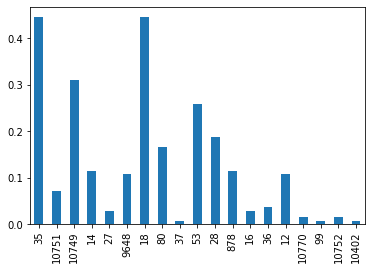
    


```python
df_moviedb
```


<div>
<style scoped>
    .dataframe tbody tr th:only-of-type {
        vertical-align: middle;
    }

    .dataframe tbody tr th {
        vertical-align: top;
    }

    .dataframe thead th {
        text-align: right;
    }
</style>
<table border="1" class="dataframe">
  <thead>
    <tr style="text-align: right;">
      <th></th>
      <th>35</th>
      <th>10751</th>
      <th>10749</th>
      <th>14</th>
      <th>27</th>
      <th>9648</th>
      <th>18</th>
      <th>80</th>
      <th>37</th>
      <th>53</th>
      <th>28</th>
      <th>878</th>
      <th>16</th>
      <th>36</th>
      <th>12</th>
      <th>10770</th>
      <th>99</th>
      <th>10752</th>
      <th>10402</th>
    </tr>
  </thead>
  <tbody>
    <tr>
      <th>0</th>
      <td>1.0</td>
      <td>1.0</td>
      <td>0.0</td>
      <td>0.0</td>
      <td>0.0</td>
      <td>0.0</td>
      <td>0.0</td>
      <td>0.0</td>
      <td>0.0</td>
      <td>0.0</td>
      <td>0.0</td>
      <td>0.0</td>
      <td>0.0</td>
      <td>0.0</td>
      <td>0.0</td>
      <td>0.0</td>
      <td>0.0</td>
      <td>0.0</td>
      <td>0.0</td>
    </tr>
    <tr>
      <th>1</th>
      <td>1.0</td>
      <td>0.0</td>
      <td>1.0</td>
      <td>0.0</td>
      <td>0.0</td>
      <td>0.0</td>
      <td>0.0</td>
      <td>0.0</td>
      <td>0.0</td>
      <td>0.0</td>
      <td>0.0</td>
      <td>0.0</td>
      <td>0.0</td>
      <td>0.0</td>
      <td>0.0</td>
      <td>0.0</td>
      <td>0.0</td>
      <td>0.0</td>
      <td>0.0</td>
    </tr>
    <tr>
      <th>2</th>
      <td>1.0</td>
      <td>1.0</td>
      <td>1.0</td>
      <td>0.0</td>
      <td>0.0</td>
      <td>0.0</td>
      <td>0.0</td>
      <td>0.0</td>
      <td>0.0</td>
      <td>0.0</td>
      <td>0.0</td>
      <td>0.0</td>
      <td>0.0</td>
      <td>0.0</td>
      <td>0.0</td>
      <td>0.0</td>
      <td>0.0</td>
      <td>0.0</td>
      <td>0.0</td>
    </tr>
    <tr>
      <th>3</th>
      <td>1.0</td>
      <td>0.0</td>
      <td>1.0</td>
      <td>0.0</td>
      <td>0.0</td>
      <td>0.0</td>
      <td>0.0</td>
      <td>0.0</td>
      <td>0.0</td>
      <td>0.0</td>
      <td>0.0</td>
      <td>0.0</td>
      <td>0.0</td>
      <td>0.0</td>
      <td>0.0</td>
      <td>0.0</td>
      <td>0.0</td>
      <td>0.0</td>
      <td>0.0</td>
    </tr>
    <tr>
      <th>4</th>
      <td>1.0</td>
      <td>0.0</td>
      <td>0.0</td>
      <td>1.0</td>
      <td>1.0</td>
      <td>1.0</td>
      <td>0.0</td>
      <td>0.0</td>
      <td>0.0</td>
      <td>0.0</td>
      <td>0.0</td>
      <td>0.0</td>
      <td>0.0</td>
      <td>0.0</td>
      <td>0.0</td>
      <td>0.0</td>
      <td>0.0</td>
      <td>0.0</td>
      <td>0.0</td>
    </tr>
    <tr>
      <th>...</th>
      <td>...</td>
      <td>...</td>
      <td>...</td>
      <td>...</td>
      <td>...</td>
      <td>...</td>
      <td>...</td>
      <td>...</td>
      <td>...</td>
      <td>...</td>
      <td>...</td>
      <td>...</td>
      <td>...</td>
      <td>...</td>
      <td>...</td>
      <td>...</td>
      <td>...</td>
      <td>...</td>
      <td>...</td>
    </tr>
    <tr>
      <th>134</th>
      <td>0.0</td>
      <td>0.0</td>
      <td>0.0</td>
      <td>0.0</td>
      <td>0.0</td>
      <td>1.0</td>
      <td>0.0</td>
      <td>0.0</td>
      <td>0.0</td>
      <td>1.0</td>
      <td>0.0</td>
      <td>1.0</td>
      <td>0.0</td>
      <td>0.0</td>
      <td>0.0</td>
      <td>0.0</td>
      <td>0.0</td>
      <td>0.0</td>
      <td>0.0</td>
    </tr>
    <tr>
      <th>135</th>
      <td>1.0</td>
      <td>0.0</td>
      <td>0.0</td>
      <td>0.0</td>
      <td>0.0</td>
      <td>0.0</td>
      <td>0.0</td>
      <td>0.0</td>
      <td>0.0</td>
      <td>0.0</td>
      <td>0.0</td>
      <td>0.0</td>
      <td>0.0</td>
      <td>0.0</td>
      <td>0.0</td>
      <td>0.0</td>
      <td>0.0</td>
      <td>0.0</td>
      <td>0.0</td>
    </tr>
    <tr>
      <th>136</th>
      <td>1.0</td>
      <td>1.0</td>
      <td>0.0</td>
      <td>0.0</td>
      <td>0.0</td>
      <td>0.0</td>
      <td>0.0</td>
      <td>0.0</td>
      <td>0.0</td>
      <td>0.0</td>
      <td>0.0</td>
      <td>0.0</td>
      <td>0.0</td>
      <td>0.0</td>
      <td>1.0</td>
      <td>0.0</td>
      <td>0.0</td>
      <td>0.0</td>
      <td>0.0</td>
    </tr>
    <tr>
      <th>137</th>
      <td>1.0</td>
      <td>0.0</td>
      <td>0.0</td>
      <td>0.0</td>
      <td>0.0</td>
      <td>0.0</td>
      <td>1.0</td>
      <td>1.0</td>
      <td>0.0</td>
      <td>0.0</td>
      <td>0.0</td>
      <td>0.0</td>
      <td>0.0</td>
      <td>0.0</td>
      <td>0.0</td>
      <td>0.0</td>
      <td>0.0</td>
      <td>0.0</td>
      <td>0.0</td>
    </tr>
    <tr>
      <th>138</th>
      <td>1.0</td>
      <td>0.0</td>
      <td>0.0</td>
      <td>0.0</td>
      <td>0.0</td>
      <td>0.0</td>
      <td>0.0</td>
      <td>0.0</td>
      <td>0.0</td>
      <td>0.0</td>
      <td>0.0</td>
      <td>0.0</td>
      <td>0.0</td>
      <td>0.0</td>
      <td>0.0</td>
      <td>0.0</td>
      <td>0.0</td>
      <td>0.0</td>
      <td>0.0</td>
    </tr>
  </tbody>
</table>
<p>139 rows × 19 columns</p>
</div>


```python
hist = []
list_a = []
df_moviedb_hist = pd.DataFrame()


for i in range(139):
    vector = df_moviedb.iloc[i]
    bit = BitArray(vector)
    ent = bit.uint
    #print(ent)
    hist.append(int(ent))
    df_moviedb_hist= df_moviedb_hist.append(pd.Series(vector, index=df_moviedb.columns ), ignore_index=True)
h = np.histogram(hist)
print(len(hist))
print(stat.mode(hist))
plt.hist(hist, bins=50)

```

    139
    327680


    (array([44.,  7.,  1.,  3.,  5.,  0.,  0., 11.,  1.,  0.,  0.,  1.,  0.,
             0.,  2.,  0.,  0.,  1.,  0.,  0.,  0.,  1.,  0.,  0.,  0.,  0.,
             0.,  0., 20.,  7.,  0.,  0.,  1.,  0.,  1., 15.,  9.,  0.,  0.,
             3.,  0.,  0.,  3.,  0.,  0.,  0.,  1.,  0.,  0.,  2.]),
     array([4.0000000e+00, 9.1789600e+03, 1.8353920e+04, 2.7528880e+04,
            3.6703840e+04, 4.5878800e+04, 5.5053760e+04, 6.4228720e+04,
            7.3403680e+04, 8.2578640e+04, 9.1753600e+04, 1.0092856e+05,
            1.1010352e+05, 1.1927848e+05, 1.2845344e+05, 1.3762840e+05,
            1.4680336e+05, 1.5597832e+05, 1.6515328e+05, 1.7432824e+05,
            1.8350320e+05, 1.9267816e+05, 2.0185312e+05, 2.1102808e+05,
            2.2020304e+05, 2.2937800e+05, 2.3855296e+05, 2.4772792e+05,
            2.5690288e+05, 2.6607784e+05, 2.7525280e+05, 2.8442776e+05,
            2.9360272e+05, 3.0277768e+05, 3.1195264e+05, 3.2112760e+05,
            3.3030256e+05, 3.3947752e+05, 3.4865248e+05, 3.5782744e+05,
            3.6700240e+05, 3.7617736e+05, 3.8535232e+05, 3.9452728e+05,
            4.0370224e+05, 4.1287720e+05, 4.2205216e+05, 4.3122712e+05,
            4.4040208e+05, 4.4957704e+05, 4.5875200e+05]),
     <BarContainer object of 50 artists>)


    
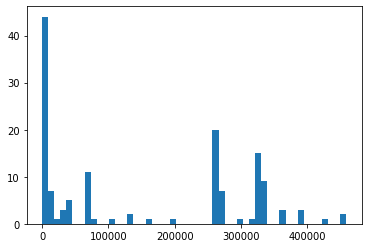
    


```python
df_moviedb_hist
```


<div>
<style scoped>
    .dataframe tbody tr th:only-of-type {
        vertical-align: middle;
    }

    .dataframe tbody tr th {
        vertical-align: top;
    }

    .dataframe thead th {
        text-align: right;
    }
</style>
<table border="1" class="dataframe">
  <thead>
    <tr style="text-align: right;">
      <th></th>
      <th>12</th>
      <th>14</th>
      <th>16</th>
      <th>18</th>
      <th>27</th>
      <th>28</th>
      <th>35</th>
      <th>36</th>
      <th>37</th>
      <th>53</th>
      <th>80</th>
      <th>99</th>
      <th>878</th>
      <th>9648</th>
      <th>10402</th>
      <th>10749</th>
      <th>10751</th>
      <th>10752</th>
      <th>10770</th>
    </tr>
  </thead>
  <tbody>
    <tr>
      <th>0</th>
      <td>0.0</td>
      <td>0.0</td>
      <td>0.0</td>
      <td>0.0</td>
      <td>0.0</td>
      <td>0.0</td>
      <td>1.0</td>
      <td>0.0</td>
      <td>0.0</td>
      <td>0.0</td>
      <td>0.0</td>
      <td>0.0</td>
      <td>0.0</td>
      <td>0.0</td>
      <td>0.0</td>
      <td>0.0</td>
      <td>1.0</td>
      <td>0.0</td>
      <td>0.0</td>
    </tr>
    <tr>
      <th>1</th>
      <td>0.0</td>
      <td>0.0</td>
      <td>0.0</td>
      <td>0.0</td>
      <td>0.0</td>
      <td>0.0</td>
      <td>1.0</td>
      <td>0.0</td>
      <td>0.0</td>
      <td>0.0</td>
      <td>0.0</td>
      <td>0.0</td>
      <td>0.0</td>
      <td>0.0</td>
      <td>0.0</td>
      <td>1.0</td>
      <td>0.0</td>
      <td>0.0</td>
      <td>0.0</td>
    </tr>
    <tr>
      <th>2</th>
      <td>0.0</td>
      <td>0.0</td>
      <td>0.0</td>
      <td>0.0</td>
      <td>0.0</td>
      <td>0.0</td>
      <td>1.0</td>
      <td>0.0</td>
      <td>0.0</td>
      <td>0.0</td>
      <td>0.0</td>
      <td>0.0</td>
      <td>0.0</td>
      <td>0.0</td>
      <td>0.0</td>
      <td>1.0</td>
      <td>1.0</td>
      <td>0.0</td>
      <td>0.0</td>
    </tr>
    <tr>
      <th>3</th>
      <td>0.0</td>
      <td>0.0</td>
      <td>0.0</td>
      <td>0.0</td>
      <td>0.0</td>
      <td>0.0</td>
      <td>1.0</td>
      <td>0.0</td>
      <td>0.0</td>
      <td>0.0</td>
      <td>0.0</td>
      <td>0.0</td>
      <td>0.0</td>
      <td>0.0</td>
      <td>0.0</td>
      <td>1.0</td>
      <td>0.0</td>
      <td>0.0</td>
      <td>0.0</td>
    </tr>
    <tr>
      <th>4</th>
      <td>0.0</td>
      <td>1.0</td>
      <td>0.0</td>
      <td>0.0</td>
      <td>1.0</td>
      <td>0.0</td>
      <td>1.0</td>
      <td>0.0</td>
      <td>0.0</td>
      <td>0.0</td>
      <td>0.0</td>
      <td>0.0</td>
      <td>0.0</td>
      <td>1.0</td>
      <td>0.0</td>
      <td>0.0</td>
      <td>0.0</td>
      <td>0.0</td>
      <td>0.0</td>
    </tr>
    <tr>
      <th>...</th>
      <td>...</td>
      <td>...</td>
      <td>...</td>
      <td>...</td>
      <td>...</td>
      <td>...</td>
      <td>...</td>
      <td>...</td>
      <td>...</td>
      <td>...</td>
      <td>...</td>
      <td>...</td>
      <td>...</td>
      <td>...</td>
      <td>...</td>
      <td>...</td>
      <td>...</td>
      <td>...</td>
      <td>...</td>
    </tr>
    <tr>
      <th>134</th>
      <td>0.0</td>
      <td>0.0</td>
      <td>0.0</td>
      <td>0.0</td>
      <td>0.0</td>
      <td>0.0</td>
      <td>0.0</td>
      <td>0.0</td>
      <td>0.0</td>
      <td>1.0</td>
      <td>0.0</td>
      <td>0.0</td>
      <td>1.0</td>
      <td>1.0</td>
      <td>0.0</td>
      <td>0.0</td>
      <td>0.0</td>
      <td>0.0</td>
      <td>0.0</td>
    </tr>
    <tr>
      <th>135</th>
      <td>0.0</td>
      <td>0.0</td>
      <td>0.0</td>
      <td>0.0</td>
      <td>0.0</td>
      <td>0.0</td>
      <td>1.0</td>
      <td>0.0</td>
      <td>0.0</td>
      <td>0.0</td>
      <td>0.0</td>
      <td>0.0</td>
      <td>0.0</td>
      <td>0.0</td>
      <td>0.0</td>
      <td>0.0</td>
      <td>0.0</td>
      <td>0.0</td>
      <td>0.0</td>
    </tr>
    <tr>
      <th>136</th>
      <td>1.0</td>
      <td>0.0</td>
      <td>0.0</td>
      <td>0.0</td>
      <td>0.0</td>
      <td>0.0</td>
      <td>1.0</td>
      <td>0.0</td>
      <td>0.0</td>
      <td>0.0</td>
      <td>0.0</td>
      <td>0.0</td>
      <td>0.0</td>
      <td>0.0</td>
      <td>0.0</td>
      <td>0.0</td>
      <td>1.0</td>
      <td>0.0</td>
      <td>0.0</td>
    </tr>
    <tr>
      <th>137</th>
      <td>0.0</td>
      <td>0.0</td>
      <td>0.0</td>
      <td>1.0</td>
      <td>0.0</td>
      <td>0.0</td>
      <td>1.0</td>
      <td>0.0</td>
      <td>0.0</td>
      <td>0.0</td>
      <td>1.0</td>
      <td>0.0</td>
      <td>0.0</td>
      <td>0.0</td>
      <td>0.0</td>
      <td>0.0</td>
      <td>0.0</td>
      <td>0.0</td>
      <td>0.0</td>
    </tr>
    <tr>
      <th>138</th>
      <td>0.0</td>
      <td>0.0</td>
      <td>0.0</td>
      <td>0.0</td>
      <td>0.0</td>
      <td>0.0</td>
      <td>1.0</td>
      <td>0.0</td>
      <td>0.0</td>
      <td>0.0</td>
      <td>0.0</td>
      <td>0.0</td>
      <td>0.0</td>
      <td>0.0</td>
      <td>0.0</td>
      <td>0.0</td>
      <td>0.0</td>
      <td>0.0</td>
      <td>0.0</td>
    </tr>
  </tbody>
</table>
<p>139 rows × 19 columns</p>
</div>


```python
def distancia(pelicula_1, pelicula_2):
    unos_i = 0
    unos_d = 0
    d = 0
    for i in pelicula_1.index :
        if pelicula_1[i]+pelicula_2[i] == 2:
            unos_i = unos_i +1
        elif pelicula_1[i]+pelicula_2[i] == 1:
            unos_d = unos_d +1
    if unos_i + unos_d == 0:
        d = 1
    else :
        d = unos_d/( unos_i + unos_d)
    return d

pelicula_1 = df_moviedb.iloc[0]
pelicula_2 = df_moviedb.iloc[1]

d = distancia(pelicula_1, pelicula_2)
print(d)
```

    0.6666666666666666


```python
def centroide(clase):
    #centroide  = pd.Series([0]*19)
    llave_pelicula = clase[0]
    centroide = df_moviedb.iloc[llave_pelicula]
    for llave_pelicula in clase[1:]:
        pelicula = df_moviedb.iloc[llave_pelicula]
        centroide = centroide + pelicula
    centroide = centroide/ len(clase)
    print(centroide)
clase = [0,1]
c = centroide(clase)
```

    35       1.0
    10751    0.5
    10749    0.5
    14       0.0
    27       0.0
    9648     0.0
    18       0.0
    80       0.0
    37       0.0
    53       0.0
    28       0.0
    878      0.0
    16       0.0
    36       0.0
    12       0.0
    10770    0.0
    99       0.0
    10752    0.0
    10402    0.0
    dtype: float64


```python
def clasificador(df):
    for i in range(len(df_grafo)):
        vector = df.iloc[i]
```


```python

```


```python
def k_means(df):
    k = 3
    k_mean = [[]]*k
    s = random.sample(range(len(df)),k=k)
    print(s)
    return k_mean
print(k_means(df_moviedb))
```

    [5, 65, 17]
    [[], [], []]


```python
k = 0 

df_grafo = df_moviedb
#df_grafo = df_moviedb_hist
G=nx.Graph()
# agregar lista de nodos [0,1,2,...138]
G.add_nodes_from(range(len(df_grafo)))

for i in range( len(df_grafo) ):
    for j in range(i+1,len(df_grafo)):
        #print("i",i, "j", j )
        vector_i = df_grafo.iloc[i]
        vector_j = df_grafo.iloc[j]
        d = distancia( vector_i , vector_j )
        if d == 1:
            pass 
        elif d < 0.5 : 
            #print( i , "->" , j )
            G.add_edge(i,j)
            k = k + 1

           
print(k)
```

    821


```python
2/19
```


    0.10526315789473684


```python
nx.draw(G)
```


    

    


```python
nx.draw_spectral(G)
```


    

    


```python
pos=nx.random_layout(G)
pos=nx.kamada_kawai_layout(G)
pos = nx.spiral_layout(G)
pos = nx.spring_layout(G)
pos = nx.shell_layout(G)
pos = nx.circular_layout(G)

pos=nx.random_layout(G)

nx.draw(G,pos)
```


    
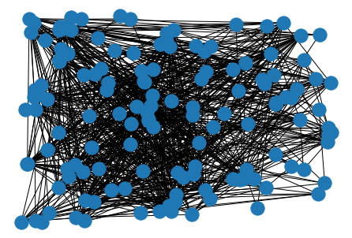
    


```python
num_clases = nx.number_connected_components(G)
num_clases
```


    16


```python
sub_g = [G.subgraph(c).copy() for c in nx.connected_components(G)]
i = 0
for s in sub_g :
    plt.figure(1)
    nx.draw(s,pos)
    plt.savefig(str(i)+'.png')
    plt.clf()
    i = i + 1
```


    <Figure size 432x288 with 0 Axes>


```python
df_moviedb.plot.hist()
```


    <AxesSubplot:ylabel='Frequency'>


    
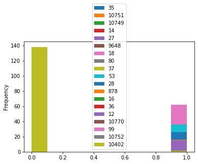
    


```python
def get_vector(generos):
    vector = [0]*19
    for g in generos :
        indice = dict_g[g]
        vector[indice]= 1
    return vector

dict_m = {}
dict_pelicula = {}
lista_m = df_peliculas['Title_1']
set_generos = set()
for movie in lista_m:
    url = 'https://api.themoviedb.org/3/search/movie?api_key=3c35ea3e9d8c1a6d96d7dd37f74a52b0&page=1&query='+movie
    r = requests.get(url=url)
    json = r.json()
    if len ( json['results'] ) > 0 :
        for res in json['results'] :
            v_generos = get_vector(res['genre_ids'])
            dict_pelicula[movie] = v_generos
            
            

print( dict_pelicula )
```

    {'Kung Fu Panda 2': [0, 1, 1, 1, 0, 0, 0, 1, 0, 0, 0, 0, 0, 0, 0, 0, 0, 0, 0], 'La estrella de Belén': [0, 1, 1, 1, 0, 0, 0, 1, 1, 0, 0, 0, 0, 0, 0, 0, 0, 0, 0], 'La Nochebuena es mi condena': [0, 0, 0, 1, 0, 0, 0, 1, 0, 0, 0, 0, 0, 0, 0, 0, 0, 0, 0], 'El teléfono': [1, 0, 0, 0, 1, 0, 0, 0, 0, 0, 0, 0, 0, 0, 0, 0, 1, 0, 0], 'El caballero de la Navidad': [0, 0, 0, 1, 0, 0, 0, 0, 0, 0, 0, 0, 0, 1, 0, 0, 0, 0, 0], 'Un príncipe de Navidad': [0, 0, 0, 1, 0, 0, 0, 0, 0, 0, 0, 0, 0, 1, 0, 0, 0, 0, 0], 'Flechazo a primera vista': [0, 0, 0, 0, 0, 0, 0, 0, 0, 0, 0, 0, 0, 0, 0, 1, 0, 0, 0], 'Intercambio de princesas 2': [0, 0, 0, 1, 0, 0, 1, 1, 0, 0, 0, 0, 0, 1, 0, 0, 0, 0, 0], 'Operación Feliz Navidad': [0, 0, 0, 1, 0, 0, 0, 1, 0, 0, 0, 0, 0, 1, 0, 0, 0, 0, 0], 'Escuadrón 6': [0, 0, 0, 0, 0, 0, 0, 0, 0, 0, 0, 0, 0, 0, 1, 0, 0, 0, 0], 'Amor de calendario': [0, 0, 0, 1, 0, 0, 0, 0, 0, 0, 0, 0, 0, 1, 0, 0, 0, 0, 0], 'El Halloween de Hubie': [0, 0, 0, 1, 0, 0, 0, 0, 1, 0, 1, 0, 1, 0, 0, 0, 0, 0, 0], 'Enola Holmes': [0, 0, 0, 0, 1, 0, 1, 0, 0, 0, 0, 0, 1, 0, 0, 0, 0, 0, 0], 'Django sin cadenas': [0, 0, 0, 0, 0, 0, 1, 0, 0, 0, 0, 0, 0, 0, 0, 0, 0, 0, 1], 'Kung Fu Panda': [0, 0, 0, 0, 0, 0, 0, 0, 0, 0, 0, 0, 0, 0, 0, 0, 0, 0, 0], 'Parásitos': [0, 0, 0, 1, 0, 0, 1, 0, 0, 0, 0, 0, 0, 0, 0, 0, 1, 0, 0], 'El practicante': [0, 0, 0, 0, 0, 0, 1, 0, 0, 0, 0, 0, 0, 0, 0, 0, 1, 0, 0], 'El diablo a todas horas': [0, 0, 0, 0, 1, 0, 1, 0, 0, 0, 0, 0, 0, 0, 0, 0, 1, 0, 0], 'Avengement': [1, 0, 0, 0, 0, 0, 0, 0, 0, 0, 0, 0, 0, 0, 0, 0, 0, 0, 0], 'No respires': [0, 0, 0, 0, 0, 0, 0, 0, 0, 0, 0, 0, 0, 0, 0, 0, 0, 0, 0], 'La leyenda del jinete sin cabeza': [0, 0, 1, 0, 0, 0, 0, 1, 1, 0, 1, 0, 0, 0, 0, 0, 0, 0, 0], 'La isla siniestra': [0, 0, 0, 0, 0, 0, 1, 0, 0, 0, 0, 0, 1, 0, 0, 0, 1, 0, 0], 'Spectral': [0, 0, 0, 0, 0, 0, 0, 0, 0, 0, 0, 0, 0, 0, 0, 0, 0, 0, 0], 'Pienso en el final': [0, 0, 0, 0, 0, 0, 1, 0, 0, 0, 0, 0, 0, 0, 0, 0, 1, 0, 0], 'Soltero en casa': [0, 0, 0, 1, 0, 0, 0, 0, 0, 0, 0, 0, 0, 0, 0, 0, 0, 0, 0], 'La lista de al carajo': [0, 0, 0, 1, 0, 0, 0, 0, 0, 0, 0, 0, 0, 0, 0, 0, 0, 0, 0], 'Control total': [1, 0, 0, 1, 0, 0, 0, 0, 0, 0, 0, 0, 0, 0, 0, 0, 0, 0, 0], 'Una historia diferente': [0, 0, 0, 1, 0, 0, 0, 0, 1, 0, 0, 0, 0, 1, 0, 0, 0, 0, 0], 'Proyecto Power': [1, 0, 0, 0, 1, 0, 0, 0, 0, 0, 0, 0, 0, 0, 1, 0, 0, 0, 0], 'Wolf Warrior': [1, 0, 0, 0, 0, 0, 0, 0, 0, 0, 0, 0, 0, 0, 0, 0, 0, 1, 0], 'Cars 2': [0, 0, 0, 0, 0, 0, 0, 0, 0, 0, 0, 0, 0, 1, 0, 0, 0, 0, 1], 'No soy un hombre fácil': [0, 0, 0, 1, 0, 0, 0, 0, 0, 0, 0, 0, 0, 0, 0, 0, 0, 0, 0], 'El gran Lebowski': [0, 0, 0, 1, 1, 0, 0, 0, 0, 0, 0, 0, 0, 0, 0, 0, 0, 0, 0], 'El stand de los besos': [0, 0, 0, 1, 0, 0, 0, 0, 0, 0, 0, 0, 0, 1, 0, 0, 0, 0, 0], 'Todo un parto': [0, 0, 0, 1, 0, 0, 1, 0, 0, 0, 0, 0, 0, 0, 0, 0, 0, 0, 0], 'Los caballeros': [1, 1, 0, 0, 0, 0, 1, 0, 0, 0, 0, 0, 0, 0, 0, 0, 0, 0, 0], 'MILF': [0, 0, 0, 0, 0, 0, 0, 0, 0, 0, 0, 0, 0, 0, 0, 0, 0, 0, 0], 'Perro Salvaje': [0, 0, 0, 0, 0, 0, 0, 0, 0, 0, 1, 0, 0, 0, 0, 0, 0, 0, 0], 'Eterno resplandor de una mente sin recuerdos': [0, 0, 0, 0, 0, 0, 1, 0, 0, 0, 0, 0, 0, 1, 1, 0, 0, 0, 0], '¿Cómo sobrevivir a mi ex?': [0, 0, 0, 1, 0, 0, 1, 0, 0, 0, 0, 0, 0, 1, 0, 0, 0, 0, 0], 'Círculo': [1, 1, 0, 1, 1, 0, 0, 0, 0, 0, 0, 0, 0, 0, 0, 0, 1, 0, 0], 'Inmortales': [1, 1, 0, 0, 0, 0, 0, 0, 1, 0, 0, 0, 0, 0, 0, 0, 0, 0, 0], 'Anon': [0, 0, 0, 0, 1, 0, 0, 0, 0, 0, 1, 0, 0, 0, 0, 0, 0, 0, 0], 'Francotirador': [1, 0, 1, 0, 0, 0, 1, 0, 0, 0, 0, 0, 1, 0, 0, 0, 0, 0, 0], 'Dumplin': [0, 0, 0, 0, 0, 0, 0, 0, 0, 0, 1, 0, 0, 0, 0, 0, 0, 0, 0], 'El juego de la fortuna': [0, 0, 0, 0, 0, 0, 1, 0, 0, 0, 0, 0, 0, 0, 0, 0, 0, 0, 0], 'Si fueras yo': [0, 0, 0, 1, 0, 0, 0, 0, 0, 0, 0, 0, 0, 0, 0, 0, 0, 0, 0], 'Una esposa de mentira': [0, 0, 0, 1, 0, 0, 0, 0, 0, 0, 0, 0, 0, 1, 0, 0, 0, 0, 0], 'La vieja guardia': [1, 0, 0, 0, 0, 0, 0, 0, 1, 0, 0, 0, 0, 0, 0, 0, 0, 0, 0], 'Mujer Maravilla': [0, 0, 0, 0, 0, 0, 1, 0, 0, 0, 0, 0, 0, 1, 0, 0, 0, 0, 0], 'Perdidos en Tokio': [0, 0, 0, 1, 0, 0, 1, 0, 0, 0, 0, 0, 0, 1, 0, 0, 0, 0, 0], 'Ride': [0, 0, 0, 1, 0, 0, 0, 0, 0, 0, 0, 0, 0, 0, 0, 0, 0, 0, 0], 'Mío o de nadie': [0, 0, 0, 0, 0, 0, 1, 0, 0, 0, 0, 0, 0, 0, 0, 0, 1, 0, 0], 'Feliz día de tu muerte': [0, 0, 0, 1, 0, 0, 0, 0, 0, 0, 1, 0, 0, 0, 1, 0, 0, 0, 0], 'El cuento de la princesa Kaguya': [0, 0, 1, 0, 0, 0, 1, 0, 1, 0, 0, 0, 0, 0, 0, 0, 0, 0, 0], 'Un golpe con estilo': [0, 0, 0, 1, 1, 0, 0, 0, 0, 0, 0, 0, 0, 0, 0, 0, 0, 0, 0], 'Vaselina': [0, 0, 0, 1, 0, 0, 0, 1, 0, 0, 0, 1, 0, 1, 0, 0, 0, 0, 0], '¿No es romántico?': [0, 0, 0, 1, 0, 0, 0, 0, 1, 0, 0, 0, 0, 1, 0, 0, 0, 0, 0], 'Si supieras': [0, 0, 0, 1, 0, 0, 0, 0, 0, 0, 0, 0, 0, 1, 0, 0, 0, 0, 0], 'Climax': [0, 0, 0, 0, 0, 0, 0, 0, 0, 0, 0, 0, 0, 0, 0, 0, 0, 0, 0], 'La Fille du Patron': [0, 0, 0, 1, 0, 0, 1, 0, 0, 0, 0, 0, 0, 1, 0, 0, 0, 0, 0], 'Señorita J': [0, 0, 0, 0, 0, 0, 0, 0, 0, 0, 0, 0, 0, 0, 0, 0, 1, 0, 0], 'La otra Missy': [0, 0, 0, 1, 0, 0, 0, 0, 0, 0, 0, 0, 0, 1, 0, 0, 0, 0, 0], 'Lazzaro feliz': [0, 0, 0, 0, 0, 0, 1, 0, 1, 0, 0, 0, 0, 0, 0, 0, 0, 0, 0], 'La niñera': [0, 0, 0, 1, 0, 0, 0, 1, 1, 0, 0, 0, 0, 0, 0, 0, 0, 0, 0], 'A pesar de todo': [0, 0, 0, 0, 0, 0, 0, 0, 0, 0, 0, 0, 0, 0, 0, 0, 0, 0, 0], 'Kiki, el amor se hace': [0, 0, 0, 1, 0, 0, 0, 0, 0, 0, 0, 0, 0, 1, 0, 0, 0, 0, 0], 'Ricos de amor': [0, 0, 0, 1, 0, 0, 0, 0, 0, 0, 0, 0, 0, 1, 0, 0, 0, 0, 0], 'Oh, Ramona!': [0, 0, 0, 1, 0, 0, 0, 0, 0, 0, 0, 0, 0, 1, 0, 0, 0, 0, 0], 'Logan Lucky': [1, 0, 0, 1, 1, 0, 1, 0, 0, 0, 0, 0, 0, 0, 0, 0, 0, 0, 0], 'Misión de rescate': [1, 1, 1, 1, 0, 0, 0, 0, 0, 0, 0, 0, 0, 0, 0, 0, 0, 0, 0], 'Día del atentado': [1, 0, 0, 0, 1, 0, 1, 0, 0, 1, 0, 0, 0, 0, 0, 0, 1, 0, 0], 'Epidemia': [0, 0, 0, 0, 0, 0, 0, 0, 0, 0, 0, 0, 0, 0, 0, 0, 0, 0, 1], 'Harry Potter y la Orden del Fénix': [0, 1, 0, 0, 0, 0, 0, 0, 1, 0, 0, 0, 1, 0, 0, 0, 0, 0, 0], 'La influencia': [0, 0, 0, 0, 0, 1, 0, 0, 0, 0, 0, 0, 0, 0, 0, 1, 0, 0, 0], 'Violet y Finch': [0, 0, 0, 0, 0, 0, 1, 0, 0, 0, 0, 0, 0, 1, 0, 0, 0, 0, 0], 'Salvajes': [0, 0, 0, 0, 0, 1, 0, 0, 0, 0, 0, 0, 0, 0, 0, 0, 0, 0, 0], 'Perdida': [0, 0, 0, 0, 0, 0, 0, 0, 0, 0, 0, 0, 0, 0, 0, 0, 0, 0, 0], 'En carne viva': [0, 0, 0, 0, 0, 0, 1, 0, 0, 0, 0, 0, 1, 0, 0, 0, 1, 0, 0], 'Su último deseo': [0, 0, 0, 0, 0, 0, 1, 0, 0, 0, 0, 0, 0, 0, 0, 0, 1, 0, 0], 'La cruda verdad': [0, 0, 0, 1, 0, 0, 0, 0, 0, 0, 0, 0, 0, 1, 0, 0, 0, 0, 0], '¿Cómo saber si es amor?': [0, 0, 0, 1, 0, 0, 1, 0, 0, 0, 0, 0, 0, 1, 0, 0, 0, 0, 0], 'El perfecto asesino': [1, 0, 0, 1, 1, 0, 0, 0, 0, 0, 0, 0, 0, 1, 0, 0, 0, 0, 0], 'Te Prometo Anarquia': [0, 0, 0, 0, 0, 0, 1, 0, 0, 0, 0, 0, 0, 1, 0, 0, 0, 0, 0], 'El destino de Júpiter': [1, 1, 0, 0, 0, 0, 0, 0, 1, 0, 0, 0, 0, 0, 1, 0, 0, 0, 0], 'El Irlandés': [1, 0, 0, 1, 1, 0, 0, 0, 0, 0, 0, 0, 0, 0, 0, 0, 1, 0, 0], 'Historia de un matrimonio': [0, 0, 0, 0, 0, 0, 1, 0, 0, 0, 0, 0, 0, 0, 0, 0, 0, 0, 0], 'Cuando nos conocimos': [0, 0, 0, 1, 0, 0, 0, 0, 1, 0, 0, 0, 0, 1, 0, 0, 0, 0, 0], '¡Hombre al agua!': [0, 0, 0, 1, 0, 0, 0, 0, 0, 0, 0, 0, 0, 1, 0, 0, 0, 0, 0], '¡Huye!': [1, 0, 0, 0, 0, 0, 1, 0, 0, 0, 0, 0, 0, 0, 0, 0, 1, 0, 0], 'Animales nocturnos': [0, 0, 0, 0, 0, 0, 1, 0, 0, 0, 0, 0, 0, 0, 0, 0, 1, 0, 0], 'Cuentos de Terramar': [0, 1, 1, 0, 0, 0, 0, 0, 1, 0, 0, 0, 0, 0, 0, 0, 0, 0, 0], 'Perdidos en el espacio': [0, 1, 0, 0, 0, 0, 0, 0, 0, 0, 0, 0, 0, 0, 1, 0, 0, 0, 0], 'Cómo ser soltera': [0, 0, 0, 1, 0, 0, 0, 0, 0, 0, 0, 0, 0, 1, 0, 0, 0, 0, 0], 'Negocios fuera de control': [0, 0, 0, 1, 0, 0, 0, 0, 0, 0, 0, 0, 0, 0, 0, 0, 0, 0, 0], 'The Discovery': [1, 0, 0, 1, 0, 1, 1, 0, 0, 0, 0, 0, 0, 0, 0, 0, 0, 0, 0], 'Muerte en el funeral': [0, 0, 0, 1, 0, 0, 0, 0, 0, 0, 0, 0, 0, 0, 0, 0, 0, 0, 0], 'The Perfection': [0, 0, 0, 0, 0, 1, 0, 0, 0, 0, 0, 0, 0, 0, 0, 0, 0, 0, 0], 'Mi vida a los diecisiete': [0, 0, 0, 1, 0, 0, 1, 0, 0, 0, 0, 0, 0, 0, 0, 0, 0, 0, 0], 'Hogar dulce hogar': [0, 0, 0, 1, 0, 0, 1, 0, 0, 0, 0, 0, 0, 0, 0, 0, 0, 0, 0], 'Como caído del cielo': [0, 0, 0, 1, 0, 0, 1, 1, 1, 0, 0, 0, 0, 1, 0, 0, 0, 0, 0], 'Tarjeta de Navidad': [0, 0, 0, 0, 0, 0, 1, 0, 0, 0, 0, 0, 0, 1, 0, 0, 0, 0, 0], 'Yo antes de ti': [0, 0, 0, 0, 0, 0, 1, 0, 0, 0, 0, 0, 0, 1, 0, 0, 0, 0, 0], 'En nombre del amor': [0, 0, 0, 0, 0, 0, 1, 0, 0, 0, 0, 0, 0, 1, 0, 0, 0, 0, 0], 'La música del terremoto': [0, 0, 0, 0, 0, 0, 1, 0, 0, 0, 0, 0, 1, 1, 0, 0, 1, 0, 0], 'The Saint': [0, 0, 0, 0, 0, 0, 0, 0, 0, 0, 0, 0, 0, 0, 0, 0, 0, 0, 0], 'Rápidos y furiosos 8': [1, 0, 0, 0, 1, 0, 1, 0, 0, 0, 0, 0, 0, 0, 0, 0, 1, 0, 0], 'Pottersville': [0, 0, 0, 1, 0, 0, 0, 0, 0, 0, 0, 0, 0, 0, 0, 0, 0, 0, 0], 'Noches blancas': [0, 0, 0, 0, 0, 0, 1, 0, 0, 0, 0, 0, 0, 0, 0, 0, 0, 0, 0], 'Klaus': [0, 0, 0, 0, 0, 1, 1, 0, 0, 0, 0, 0, 0, 0, 0, 0, 0, 0, 0], 'El rey': [0, 0, 0, 0, 0, 0, 0, 0, 0, 0, 0, 0, 0, 0, 0, 0, 0, 0, 0], '7 deseos': [0, 0, 0, 1, 0, 0, 0, 1, 1, 0, 0, 0, 0, 1, 0, 1, 0, 0, 0], 'Once Upon a Holiday': [0, 0, 0, 0, 0, 0, 0, 1, 0, 0, 0, 0, 0, 1, 0, 1, 0, 0, 0], 'Fractura': [0, 0, 0, 0, 0, 0, 0, 0, 0, 0, 0, 0, 0, 0, 0, 0, 1, 0, 0], 'Swiped': [0, 0, 0, 0, 0, 0, 0, 0, 0, 0, 1, 0, 0, 0, 0, 0, 0, 0, 0], 'Ocultos por la Luna': [0, 0, 0, 0, 0, 0, 0, 0, 0, 0, 0, 0, 1, 0, 1, 0, 1, 0, 0], 'Psicópata americano': [0, 0, 0, 0, 0, 0, 0, 0, 0, 0, 1, 0, 0, 0, 0, 0, 1, 0, 0], 'Triple frontera': [1, 1, 0, 0, 1, 0, 0, 0, 0, 0, 0, 0, 0, 0, 0, 0, 1, 0, 0], 'Tiempos violentos': [0, 0, 0, 0, 1, 0, 0, 0, 0, 0, 0, 0, 0, 0, 0, 0, 1, 0, 0], 'A mi altura': [0, 0, 0, 1, 0, 0, 1, 0, 0, 0, 0, 0, 0, 1, 0, 0, 0, 0, 0], '¿...Y dónde están las rubias?': [0, 0, 0, 1, 1, 0, 0, 0, 0, 0, 0, 0, 0, 0, 0, 0, 0, 0, 0], 'Verónica': [0, 0, 0, 0, 0, 0, 1, 0, 1, 0, 0, 0, 0, 0, 0, 0, 0, 0, 0], 'El gran pez': [0, 1, 0, 0, 0, 0, 1, 0, 1, 0, 0, 0, 0, 0, 0, 0, 0, 0, 0], 'Operación hermanos': [0, 0, 0, 0, 0, 0, 1, 0, 0, 0, 0, 0, 0, 0, 0, 0, 1, 0, 0], 'Kardec': [0, 0, 0, 0, 0, 1, 0, 0, 0, 1, 0, 0, 0, 0, 0, 0, 0, 0, 0], 'Shaft': [1, 0, 0, 0, 0, 0, 0, 0, 0, 0, 1, 0, 1, 0, 0, 0, 1, 0, 0], 'Venganza fatal': [1, 1, 0, 0, 0, 0, 0, 0, 0, 0, 0, 0, 0, 0, 0, 0, 0, 0, 0], 'Sextillizos': [0, 0, 0, 1, 0, 0, 0, 0, 0, 0, 0, 0, 0, 0, 0, 0, 0, 0, 0], 'Réplicas': [0, 0, 0, 0, 0, 0, 0, 0, 0, 0, 1, 0, 0, 0, 0, 0, 1, 0, 0], 'Como si fuera la primera vez': [0, 0, 0, 1, 0, 0, 0, 0, 0, 0, 0, 0, 0, 1, 0, 0, 0, 0, 0], 'Los siete pecados capitales': [1, 1, 1, 0, 0, 0, 0, 0, 1, 0, 0, 0, 0, 0, 0, 0, 0, 0, 0], '12 monos': [0, 0, 0, 0, 0, 0, 0, 0, 0, 0, 0, 0, 1, 0, 1, 0, 1, 0, 0], 'El juego de Gerald': [0, 0, 0, 0, 0, 0, 1, 0, 0, 0, 1, 0, 0, 0, 0, 0, 1, 0, 0], 'El plan perfecto': [0, 0, 0, 0, 1, 0, 1, 0, 0, 0, 0, 0, 0, 0, 0, 0, 1, 0, 0], 'Déjà Vu': [0, 0, 0, 0, 0, 0, 0, 0, 0, 0, 0, 0, 0, 0, 0, 0, 0, 0, 0], 'Nos vemos ayer': [1, 1, 0, 0, 1, 0, 1, 0, 0, 0, 0, 0, 0, 0, 1, 0, 0, 0, 0], 'AlphaGo': [0, 0, 0, 0, 0, 1, 0, 0, 0, 0, 0, 0, 0, 0, 0, 0, 0, 0, 0], 'El gran truco': [0, 0, 0, 0, 0, 0, 1, 0, 0, 0, 0, 0, 1, 0, 0, 0, 1, 0, 0], 'Señales': [0, 0, 0, 0, 0, 0, 0, 0, 0, 0, 1, 0, 0, 0, 0, 0, 0, 0, 0], 'El origen': [1, 1, 0, 0, 0, 0, 0, 0, 0, 0, 0, 0, 0, 0, 1, 0, 0, 0, 0], 'La casa del lago': [0, 0, 0, 0, 0, 0, 1, 0, 0, 0, 0, 0, 1, 1, 0, 0, 0, 0, 0], 'La química del amor': [0, 0, 0, 1, 0, 0, 0, 0, 0, 0, 0, 0, 0, 0, 0, 0, 0, 0, 0], 'Quizás para siempre': [0, 0, 0, 1, 0, 0, 0, 0, 0, 0, 0, 0, 0, 1, 0, 0, 0, 0, 0], 'El aviso': [0, 0, 0, 0, 0, 0, 0, 0, 0, 0, 0, 0, 0, 0, 0, 0, 0, 0, 0], 'El paquete': [1, 0, 0, 0, 0, 0, 0, 0, 0, 0, 0, 0, 0, 0, 0, 0, 0, 0, 0], 'Beats': [0, 0, 0, 0, 0, 1, 0, 0, 0, 0, 0, 0, 0, 0, 0, 0, 0, 0, 0], 'Novato': [0, 0, 0, 1, 0, 0, 0, 0, 0, 0, 0, 0, 0, 0, 0, 0, 0, 0, 0], 'Venganza del más allá': [1, 0, 0, 0, 0, 0, 0, 0, 0, 0, 1, 0, 0, 0, 0, 0, 1, 0, 0], 'Código abierto': [1, 0, 0, 0, 0, 0, 0, 0, 0, 0, 0, 0, 0, 0, 0, 0, 1, 0, 0], 'Flubber y el profesor chiflado': [0, 0, 0, 1, 0, 0, 0, 1, 0, 0, 0, 0, 0, 0, 1, 0, 0, 0, 0], 'Misterio a bordo': [1, 0, 0, 1, 1, 0, 0, 0, 0, 0, 0, 0, 1, 0, 0, 0, 0, 0, 0], 'I Am Mother': [0, 0, 0, 0, 0, 0, 0, 0, 0, 0, 0, 0, 0, 0, 0, 0, 0, 0, 0], 'Campamento en el fin del mundo': [1, 1, 0, 1, 0, 0, 0, 0, 0, 0, 0, 0, 0, 0, 1, 0, 0, 0, 0], 'Durante la tormenta': [0, 0, 0, 0, 0, 0, 1, 0, 0, 1, 0, 0, 0, 0, 0, 1, 0, 0, 0], 'El conjuro 2': [0, 0, 0, 0, 0, 0, 0, 0, 0, 0, 1, 0, 1, 0, 0, 0, 1, 0, 0], 'Ciudad de sombras': [0, 0, 0, 0, 1, 0, 1, 0, 0, 0, 0, 0, 0, 0, 0, 0, 1, 0, 0], 'La peor semana': [0, 0, 0, 1, 0, 0, 0, 0, 0, 0, 0, 0, 0, 0, 0, 0, 0, 0, 0], 'Un novato en apuros 2': [1, 0, 0, 1, 0, 0, 0, 0, 0, 0, 0, 0, 0, 0, 0, 0, 0, 0, 0], 'Armados y peligrosos': [1, 0, 0, 1, 1, 0, 0, 0, 0, 0, 0, 0, 0, 0, 0, 0, 0, 0, 0], 'Nuestro último verano': [0, 0, 0, 1, 0, 0, 0, 0, 0, 0, 0, 0, 0, 0, 0, 0, 0, 0, 0], 'Robando vidas': [1, 0, 0, 0, 1, 0, 1, 0, 0, 0, 0, 0, 1, 0, 0, 0, 1, 0, 0], 'Otro día para matar': [1, 0, 0, 0, 0, 0, 0, 0, 0, 0, 0, 0, 0, 0, 0, 0, 1, 0, 0], 'La quinta ola': [1, 1, 0, 0, 0, 0, 0, 0, 0, 0, 0, 0, 0, 0, 1, 0, 0, 0, 0], 'Madre': [0, 0, 0, 0, 0, 0, 0, 0, 0, 0, 0, 0, 0, 0, 0, 0, 0, 0, 0], 'Mulan': [0, 0, 0, 1, 0, 0, 0, 1, 0, 0, 0, 0, 0, 0, 0, 0, 0, 0, 0], 'La langosta': [0, 0, 0, 1, 0, 0, 1, 0, 0, 0, 0, 0, 0, 1, 0, 0, 0, 0, 0], 'Falsa identidad': [0, 0, 0, 0, 1, 0, 1, 0, 0, 0, 0, 0, 1, 0, 0, 0, 0, 0, 0], 'Dos policías rebeldes 2': [1, 0, 0, 0, 1, 0, 0, 0, 0, 0, 0, 0, 0, 0, 0, 0, 1, 0, 0], 'Red social': [0, 0, 0, 0, 0, 1, 0, 0, 0, 0, 0, 0, 0, 0, 0, 0, 0, 0, 0], 'La última ola': [0, 0, 0, 0, 0, 0, 1, 0, 0, 0, 0, 0, 1, 0, 0, 0, 1, 0, 0], 'Pandora': [0, 0, 0, 0, 0, 0, 0, 0, 0, 0, 0, 1, 0, 0, 0, 0, 0, 0, 0], 'La historia real de un falso asesino': [1, 0, 0, 1, 0, 0, 0, 0, 0, 0, 0, 0, 0, 0, 0, 0, 0, 0, 0], 'La cita perfecta': [0, 0, 0, 1, 0, 0, 0, 0, 0, 0, 0, 0, 0, 1, 0, 0, 0, 0, 0], 'Contratiempo': [0, 0, 0, 0, 0, 0, 1, 0, 0, 0, 0, 0, 1, 0, 0, 0, 1, 0, 0], '30 minutos o menos': [1, 1, 0, 1, 0, 0, 0, 0, 0, 0, 0, 0, 0, 0, 0, 0, 0, 0, 0], 'Tienda de unicornios': [0, 0, 0, 1, 0, 0, 1, 0, 1, 0, 0, 0, 0, 0, 0, 0, 0, 0, 0], 'El hombre de acero': [1, 1, 0, 0, 0, 0, 0, 0, 1, 0, 0, 0, 0, 0, 1, 0, 0, 0, 0], 'Colonia': [1, 0, 0, 0, 0, 0, 0, 0, 0, 0, 1, 0, 0, 0, 1, 0, 0, 0, 0], 'Bright': [0, 0, 0, 0, 0, 0, 1, 0, 0, 0, 0, 0, 0, 0, 0, 0, 0, 1, 0], 'Escolta': [0, 0, 0, 0, 0, 0, 1, 0, 0, 1, 0, 0, 0, 0, 0, 1, 0, 1, 0], 'En primera plana': [0, 0, 0, 0, 0, 0, 1, 0, 0, 1, 0, 0, 0, 0, 0, 0, 1, 0, 0], 'El sexto sentido': [0, 0, 0, 0, 0, 0, 1, 0, 0, 0, 0, 0, 1, 0, 0, 0, 1, 0, 0], 'Secretos de una obsesión': [0, 0, 0, 0, 1, 0, 1, 0, 0, 0, 0, 0, 1, 0, 0, 0, 1, 0, 0], 'El secreto de Adaline': [0, 0, 0, 0, 0, 0, 1, 0, 1, 0, 0, 0, 0, 1, 0, 0, 0, 0, 0], 'Damage': [0, 0, 0, 0, 0, 0, 0, 0, 0, 0, 0, 0, 0, 0, 0, 0, 0, 0, 0], 'El laberinto del fauno': [0, 0, 0, 0, 0, 0, 1, 0, 1, 0, 0, 0, 0, 0, 0, 0, 0, 1, 0], 'Amor a segunda vista': [0, 0, 0, 0, 0, 0, 0, 0, 0, 0, 0, 0, 0, 1, 0, 0, 0, 0, 0], 'Triste San Valentín': [0, 0, 0, 0, 0, 0, 1, 0, 0, 0, 0, 0, 0, 1, 0, 0, 0, 0, 0], 'Cómo entrenar a tu dragón': [0, 1, 1, 1, 0, 0, 0, 1, 1, 0, 0, 0, 0, 0, 0, 0, 0, 0, 0], 'White Girl': [1, 0, 0, 0, 0, 0, 1, 0, 1, 0, 0, 0, 0, 0, 0, 0, 0, 0, 0], 'Bajo el mismo cielo': [0, 0, 0, 1, 0, 0, 1, 0, 0, 0, 0, 0, 0, 1, 0, 0, 0, 0, 0], 'La bruja': [0, 0, 0, 0, 0, 0, 0, 0, 0, 0, 0, 0, 0, 0, 0, 0, 0, 0, 0], 'Babadook': [0, 0, 0, 0, 0, 1, 0, 0, 0, 0, 0, 0, 0, 0, 0, 0, 0, 0, 0], 'Mentes maestras': [1, 0, 0, 1, 1, 0, 0, 0, 0, 0, 0, 0, 0, 0, 0, 0, 0, 0, 0], 'Un despertar glorioso': [0, 0, 0, 1, 0, 0, 1, 0, 0, 0, 0, 0, 0, 1, 0, 0, 0, 0, 0], 'Intercambio de princesas': [0, 0, 0, 1, 0, 0, 1, 1, 0, 0, 0, 0, 0, 1, 0, 0, 0, 0, 0], 'Silencio': [0, 0, 0, 0, 0, 1, 0, 0, 0, 0, 0, 0, 0, 0, 0, 0, 0, 0, 0], 'Legítimo rey': [1, 0, 0, 0, 0, 0, 1, 0, 0, 1, 0, 0, 0, 0, 0, 0, 0, 0, 0], '48 deseos de Navidad': [0, 0, 0, 0, 0, 0, 0, 1, 0, 0, 0, 0, 0, 0, 0, 1, 0, 0, 0], 'ROMA': [0, 0, 0, 0, 0, 0, 0, 0, 0, 0, 0, 0, 0, 0, 0, 0, 0, 0, 0], 'El sustituto': [0, 0, 0, 0, 1, 0, 1, 0, 0, 0, 0, 0, 1, 0, 0, 0, 0, 0, 0], 'Gánster americano': [0, 0, 0, 0, 1, 0, 1, 0, 0, 0, 0, 0, 0, 0, 0, 0, 0, 0, 0], 'Mamá': [0, 0, 0, 1, 0, 0, 1, 0, 0, 0, 0, 0, 0, 0, 0, 0, 0, 0, 0], 'El calendario de Navidad': [0, 0, 0, 1, 0, 0, 0, 1, 0, 0, 0, 0, 0, 1, 0, 0, 0, 0, 0], 'Las crónicas de Navidad': [0, 1, 0, 1, 0, 0, 0, 1, 1, 0, 0, 0, 0, 0, 0, 0, 0, 0, 0], 'Siempre el mismo día': [0, 0, 0, 0, 0, 0, 1, 0, 0, 0, 0, 0, 0, 1, 0, 0, 0, 0, 0], 'La sombra de la ley': [0, 0, 0, 0, 1, 0, 1, 0, 0, 0, 0, 0, 0, 0, 0, 0, 1, 0, 0], 'Coraline y la puerta secreta': [0, 0, 1, 0, 0, 0, 0, 1, 1, 0, 0, 0, 0, 0, 0, 0, 0, 0, 0], 'Palmeras en la nieve': [0, 0, 0, 0, 0, 0, 1, 0, 0, 1, 0, 0, 0, 1, 0, 0, 0, 0, 0], 'La sociedad de los poetas muertos': [0, 0, 0, 0, 0, 0, 1, 0, 0, 0, 0, 0, 0, 0, 0, 0, 0, 0, 0], 'Robot 7723': [1, 1, 1, 0, 0, 0, 0, 1, 0, 0, 0, 0, 0, 0, 0, 0, 0, 0, 0], 'Laggies': [0, 0, 0, 1, 0, 0, 1, 0, 0, 0, 0, 0, 0, 1, 0, 0, 0, 0, 0], 'Asesino del futuro': [1, 1, 0, 1, 0, 0, 0, 0, 0, 0, 1, 0, 0, 0, 1, 0, 1, 0, 0], 'La suma de todos los miedos': [1, 0, 0, 0, 0, 0, 1, 0, 0, 0, 0, 0, 0, 0, 0, 0, 1, 0, 0], 'El protegido': [0, 0, 0, 0, 0, 0, 0, 0, 0, 0, 1, 0, 0, 0, 0, 0, 1, 0, 0], 'Bajo la piel de lobo': [0, 0, 0, 0, 0, 0, 1, 0, 0, 0, 0, 0, 0, 1, 0, 0, 0, 0, 0], 'OtherLife': [0, 0, 0, 0, 1, 0, 0, 0, 0, 0, 0, 0, 1, 0, 1, 0, 0, 0, 0], 'Londres bajo fuego': [1, 0, 0, 0, 0, 0, 0, 0, 0, 0, 0, 0, 0, 0, 0, 0, 1, 0, 0], 'Maestro del crimen': [0, 0, 0, 0, 1, 0, 1, 0, 0, 0, 0, 0, 0, 0, 0, 0, 1, 0, 0], 'El código enigma': [0, 0, 0, 0, 0, 0, 1, 0, 0, 1, 0, 0, 0, 0, 0, 0, 1, 1, 0], 'El apostador': [0, 0, 0, 0, 1, 0, 1, 0, 0, 0, 0, 0, 0, 0, 0, 0, 1, 0, 0], 'Monty Python and the Holy Grail': [0, 0, 0, 1, 0, 0, 0, 0, 0, 0, 0, 0, 0, 0, 0, 0, 0, 0, 0], 'Casino': [0, 0, 0, 0, 0, 0, 1, 0, 0, 0, 0, 0, 0, 0, 0, 0, 0, 0, 0], 'El cabo de miedo': [0, 0, 0, 0, 1, 0, 0, 0, 0, 0, 0, 0, 0, 0, 0, 0, 1, 0, 0], 'Mente indomable': [0, 0, 0, 0, 0, 0, 1, 0, 0, 0, 0, 0, 0, 0, 0, 0, 0, 0, 0], 'Fe de etarras': [0, 0, 0, 1, 0, 0, 0, 0, 0, 0, 0, 0, 0, 0, 0, 0, 0, 0, 0], 'SPF-18': [0, 0, 0, 0, 0, 0, 1, 0, 0, 0, 0, 0, 0, 1, 0, 0, 0, 0, 0], 'Sierra Burgess es una loser': [0, 0, 0, 1, 0, 0, 1, 0, 0, 0, 0, 0, 0, 1, 0, 0, 0, 0, 0], 'El solista': [0, 0, 0, 0, 0, 0, 1, 0, 0, 0, 0, 1, 0, 0, 0, 0, 0, 0, 0], 'The Most Assassinated Woman in the World': [0, 0, 0, 0, 0, 0, 0, 0, 0, 0, 0, 0, 1, 0, 0, 0, 1, 0, 0], 'Orgullo y prejuicio': [0, 0, 0, 1, 0, 0, 0, 0, 0, 0, 1, 0, 0, 1, 0, 0, 1, 0, 0], 'Camino a Marte': [0, 0, 0, 0, 0, 0, 0, 0, 0, 0, 0, 0, 0, 0, 1, 0, 0, 0, 0], 'Intensamente': [0, 1, 1, 1, 0, 0, 1, 1, 0, 0, 0, 0, 0, 0, 0, 0, 0, 0, 0], 'Las leyes de la termodinámica': [0, 0, 0, 1, 0, 0, 0, 0, 0, 0, 0, 0, 0, 1, 0, 0, 0, 0, 0], 'Órbita 9': [0, 0, 0, 0, 0, 1, 0, 0, 0, 0, 0, 0, 0, 0, 0, 0, 0, 0, 0], 'Revancha': [0, 0, 0, 0, 0, 0, 0, 0, 0, 0, 0, 0, 0, 0, 0, 0, 0, 0, 1], 'Lo mejor de mí': [0, 0, 0, 0, 0, 0, 1, 0, 0, 0, 0, 0, 0, 0, 0, 0, 0, 0, 0], 'El núcleo': [1, 1, 0, 0, 0, 0, 0, 0, 0, 0, 0, 0, 0, 0, 1, 0, 1, 0, 0], 'No me olvides': [0, 0, 0, 0, 0, 0, 1, 0, 0, 0, 0, 0, 0, 0, 0, 0, 0, 0, 0], 'A todos los chicos de los que me enamoré': [0, 0, 0, 1, 0, 0, 0, 0, 0, 0, 0, 0, 0, 1, 0, 0, 0, 0, 0], 'Protegiendo al enemigo': [1, 0, 0, 0, 0, 0, 0, 0, 0, 0, 0, 0, 0, 0, 0, 0, 1, 0, 0], 'La última profecía': [0, 0, 0, 0, 0, 0, 1, 0, 0, 0, 1, 0, 1, 0, 0, 0, 0, 0, 0], 'Un espía y medio': [1, 0, 0, 1, 0, 0, 0, 0, 0, 0, 0, 0, 1, 0, 0, 0, 0, 0, 0], 'Atrápame si puedes': [0, 0, 0, 0, 1, 0, 1, 0, 0, 0, 0, 0, 0, 0, 0, 0, 0, 0, 0], 'The Cloverfield Paradox': [1, 0, 0, 0, 0, 0, 0, 0, 0, 0, 1, 0, 0, 0, 1, 0, 1, 0, 0], 'La hija de mi mejor amigo': [0, 0, 0, 1, 0, 0, 1, 0, 0, 0, 0, 0, 0, 1, 0, 0, 0, 0, 0], 'El final de todo': [1, 1, 0, 0, 0, 0, 0, 0, 0, 0, 0, 0, 1, 0, 1, 0, 1, 0, 0], 'Extinción': [1, 0, 0, 0, 0, 0, 0, 0, 0, 0, 1, 0, 0, 0, 1, 0, 0, 0, 0], 'Papás con honores': [0, 0, 0, 1, 0, 0, 0, 0, 0, 0, 0, 0, 0, 0, 0, 0, 0, 0, 0], 'Estasis': [0, 1, 0, 0, 0, 0, 0, 0, 0, 0, 0, 0, 0, 0, 1, 0, 0, 0, 0], 'In/mortal': [0, 0, 0, 0, 0, 0, 0, 0, 0, 0, 0, 0, 1, 0, 1, 0, 1, 0, 0], 'Verano en Staten Island': [0, 0, 0, 1, 0, 0, 0, 0, 0, 0, 0, 0, 0, 0, 0, 0, 0, 0, 0], 'La invitación': [0, 0, 0, 1, 0, 0, 0, 0, 0, 0, 0, 0, 0, 0, 0, 0, 0, 0, 0], 'Día de pinta': [0, 1, 0, 1, 0, 0, 0, 1, 0, 0, 0, 0, 0, 0, 0, 0, 0, 0, 0], 'El ladrón de orquídeas': [0, 0, 0, 1, 1, 0, 1, 0, 0, 0, 0, 0, 0, 0, 0, 0, 0, 0, 0], 'La jefa': [0, 0, 0, 0, 0, 0, 0, 0, 0, 0, 0, 0, 1, 0, 0, 0, 1, 0, 0], 'Un Chofer en Apuros': [0, 0, 0, 1, 0, 0, 0, 0, 0, 0, 0, 0, 0, 0, 0, 0, 0, 0, 0], 'Cargo': [0, 1, 0, 0, 0, 0, 0, 0, 0, 0, 0, 0, 0, 0, 0, 0, 1, 0, 0], 'Corazones de hierro': [0, 0, 0, 0, 0, 0, 1, 0, 0, 1, 0, 0, 0, 0, 0, 0, 0, 1, 0], 'Guardianes de la galaxia': [0, 0, 1, 0, 0, 0, 0, 1, 0, 0, 0, 0, 0, 0, 1, 0, 0, 0, 0], 'Los Increíbles': [1, 1, 1, 0, 0, 0, 0, 1, 0, 0, 0, 0, 0, 0, 0, 0, 0, 0, 0], 'Convicto': [0, 0, 0, 0, 0, 0, 1, 0, 0, 0, 0, 0, 0, 0, 0, 0, 0, 0, 0], 'Aniquilación': [1, 0, 0, 0, 0, 0, 0, 0, 1, 0, 0, 0, 0, 0, 1, 0, 0, 0, 0], 'FullMetal Alchemist': [1, 0, 1, 0, 0, 0, 0, 0, 1, 0, 0, 0, 0, 0, 0, 0, 0, 0, 0]}


```python

```


```python
print( (set_generos) )
```

    set()


```python

```
